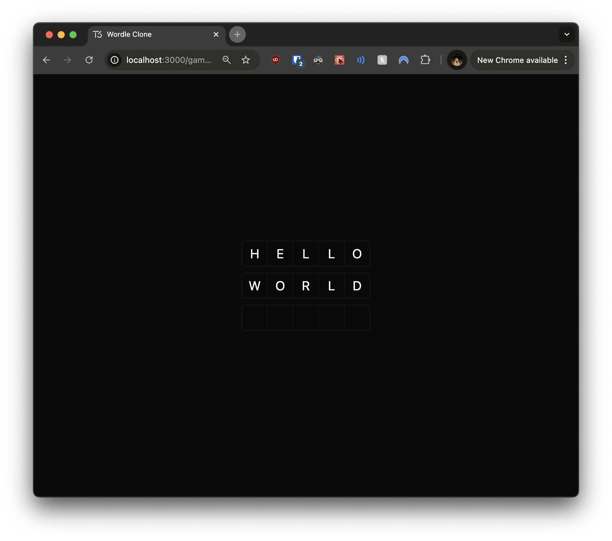
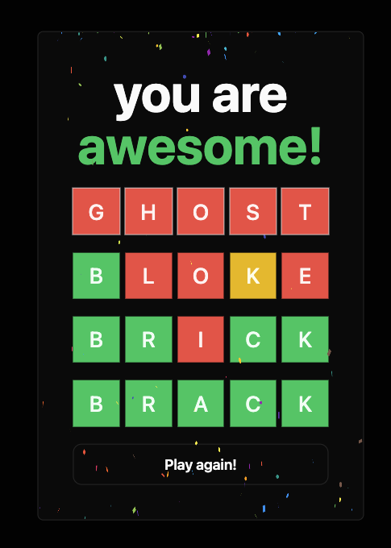

# Wordle Clone Tutorial

Welcome to the Wordle Clone Tutorial! This project guides you through building a Wordle clone using Next.js, Drizzle ORM, and shadcn/ui.






## Project Structure

```
wordle-clone/
│
├── src/
│   ├── app/                 # Next.js app directory
│   ├── components/          # React components
│   ├── lib/                 # Utility functions and shared code
│   ├── server/              # Server-side code
│   └── styles/              # CSS files
├── docs/                    # Tutorial documents and additional resources
├── public/                  # Static files
├── .env.example             # Example environment variables
├── drizzle.config.ts        # Drizzle ORM configuration
├── next.config.js           # Next.js configuration
├── package.json
├── README.md
├── tailwind.config.ts       # Tailwind CSS configuration
└── yarn.lock                # Yarn lock file
```

## Technologies Used

- Next.js 14+
- Drizzle ORM
- shadcn/ui
- TypeScript
- Tailwind CSS
- Yarn (package manager)

## Getting Started

1. Clone this repository:

   ```
   git clone https://github.com/farmcreditca/nextjs-wordle-dev-day.git
   ```

2. Open the project in Visual Studio Code:

   ```
   code nextjs-wordle-dev-day
   ```

   If you don't have VS Code installed, you can download it from [https://code.visualstudio.com/](https://code.visualstudio.com/)

3. Install the SQLite Viewer extension:

   - Open the Extensions view in VS Code (Ctrl+Shift+X or Cmd+Shift+X on macOS)
   - Search for "SQLite Viewer"
   - Install the extension by Florian Klampfer

   This extension will allow you to view your SQLite database directly in VS Code.

4. Install dependencies:

   ```
   cd nextjs-wordle-dev-day
   yarn install
   ```

5. Set up your environment variables:

   - Copy `.env.example` to `.env`

   ```
   cp .env.example .env
   ```

   - The database credentials are pre-configured in the .env.example file, so you don't need to change anything for this tutorial.

6. Run the development server:

   ```
   yarn dev
   ```

7. Open [http://localhost:3000](http://localhost:3000) in your browser to see the result.

## Tutorials and Documentation

In the `docs` folder of this project, you'll find detailed tutorials and additional resources to guide you through the development process. These documents provide step-by-step instructions, explanations of key concepts, and tips for each stage of building the Wordle clone.

Be sure to refer to these tutorials as you progress through the project. They're designed to complement the code in each checkpoint and provide a deeper understanding of the technologies and techniques used.

## Tutorial Checkpoints

The tutorial is divided into the following key stages, each represented by a checkpoint branch:

1. `main` - Initial setup
2. `checkpoint-01-drizzle-setup` - Drizzle setup
3. `checkpoint-02-game-board` - Implementing the game board UI
4. `checkpoint-03-game-logic` - Adding core game logic and state management
5. `checkpoint-04-keyboard` - Creating the on-screen keyboard
6. `checkpoint-05-word-validation` - Implementing word validation and feedback
7. `checkpoint-06-game-over` - Adding game over conditions and restart functionality
8. `checkpoint-07-styling-polish` - Final styling and UI polish

These checkpoints allow you to verify your progress or jump to a specific point in the tutorial if needed.

To switch to a checkpoint branch, use:

```
git checkout <checkpoint-branch-name>
```

## Tutorial Steps

1. Start with the `main` branch for initial setup.
2. Progress through each checkpoint, implementing the features described.
3. After completing each section, you can compare your work with the corresponding checkpoint branch.
4. If you get stuck, you can use the checkpoint branches as a reference or starting point.
5. By the time you reach the `checkpoint-07-styling-polish` branch, you'll have a fully functional Wordle clone.
