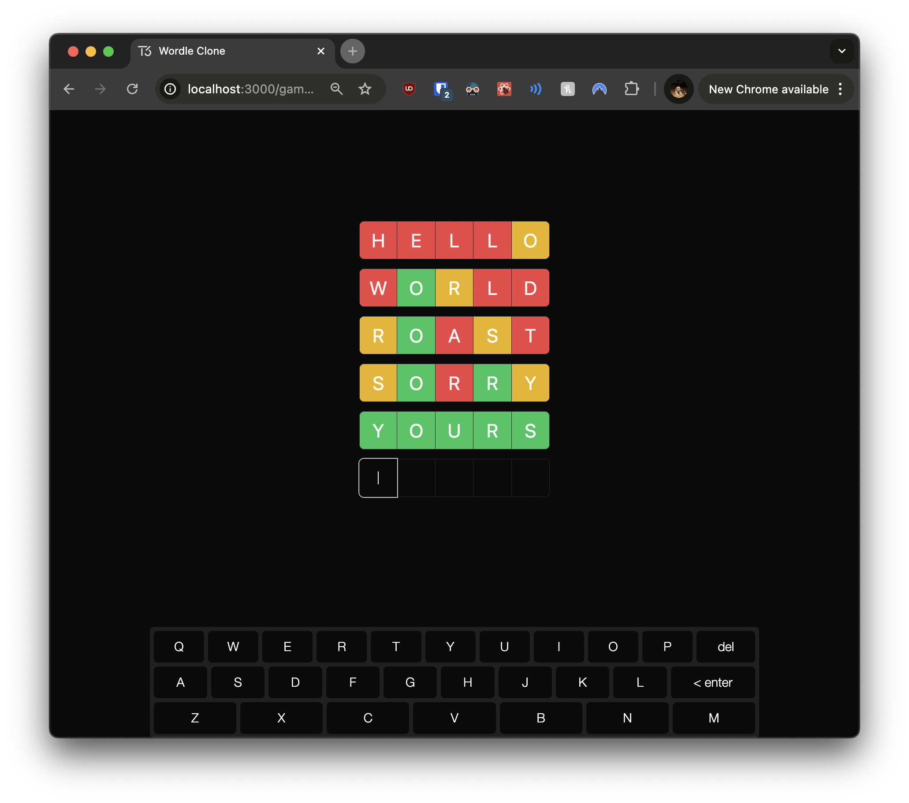

# 02: Game Board Implementation

Welcome to the second section of our tutorial! In this exercise, you'll build the game board UI using React and Next.js for our Wordle clone. This will help you understand component composition and state management in React, similar to how you'd structure components in Angular.

## Exercise Objectives

- **Set up** the game page in Next.js.
- **Create** the `GameBoard` component.
- **Implement** the `GuessInput` component.
- **Create** the `GuessList` component.
- **Implement** the `GuessItem` component.
- **Update** the root layout for styling.
- **Check** your progress by running the application.

---

## Prerequisites

Before you begin, ensure you've completed the previous section or are up to date with the `checkpoint-01-drizzle-setup` branch.

**To get up to speed:**

1. **Switch to the branch:**

   ```bash
   git checkout checkpoint-01-drizzle-setup
   ```

2. **Install dependencies:**

   ```bash
   yarn install
   ```

3. **Set up your database schema:**

   ```bash
   yarn db:push
   ```

---

## Tasks and Hints

### 1. Set Up the Game Page

**Task:** In `src/app/game/[gameId]/page.tsx`, create the game page component that will display the game board.

**Why:** This page serves as the main entry point for a game instance, utilizing Next.js dynamic routing to handle different game IDs.

**Hints:**

- **File-Based Routing:**
  - In Next.js, files inside the `app` directory define routes automatically.
  - The `[gameId]` in the folder name creates a dynamic route, similar to route parameters in Angular.
- **Import Statements:**
  - You'll need to import the `GameBoard` component, which will be the main component on this page.
- **Styling:**
  - Use Tailwind CSS classes to center the content vertically and horizontally for a clean UI.

**Example:**

```typescript
// src/app/game/[gameId]/page.tsx

import { GameBoard } from "~/components/game-board";

export default function GamePage() {
  return (
    <div className="flex h-full items-center justify-center">
      {/* Render your GameBoard component here */}
    </div>
  );
}
```

**Helpful Links:**

- [Next.js Routing Documentation](https://nextjs.org/docs/routing/introduction)
- [Dynamic Routes in Next.js](https://nextjs.org/docs/routing/dynamic-routes)
- [Tailwind CSS Flexbox Utilities](https://tailwindcss.com/docs/flex)

**Solution Code:**

<details>
<summary>Click to reveal solution</summary>

```typescript
// src/app/game/[gameId]/page.tsx

import { GameBoard } from "~/components/game-board";

// This component represents the game page for a specific game ID
export default function GamePage() {
  return (
    // Center the GameBoard component both vertically and horizontally
    <div className="flex h-full items-center justify-center">
      {/* Render the GameBoard component */}
      <GameBoard />
    </div>
  );
}
```

_Comments:_

- **Import Statement:** We import the `GameBoard` component from our components directory.
- **Function Component:** `GamePage` is a default export function that represents our page component.
- **Styling:** The `<div>` uses Tailwind CSS classes to create a flex container that centers its content.
- **Rendering `GameBoard`:** Inside the `<div>`, we render the `GameBoard` component, which we'll define later.

</details>

---

### 2. Create the `GameBoard` Component

**Task:** In `src/components/game-board.tsx`, build the main `GameBoard` component that combines the guess input and the list of guesses.

**Why:** The `GameBoard` component acts as the container for the game's UI elements, similar to a parent component in Angular.

**Hints:**

- **Component Structure:**
  - The `GameBoard` should render both the `GuessList` and `GuessInput` components.
- **State Management:**
  - Initialize a state or a variable to hold previous guesses. For now, you can use a hardcoded array to simulate this.
- **Import Statements:**
  - Import the `GuessInput` and `GuessList` components to be used within `GameBoard`.

**Example:**

```typescript
// src/components/game-board.tsx

import { GuessInput } from "./guess-input";
import { GuessList } from "./guess-list";

export const GameBoard = () => {
  // Initialize your guesses array here
  const guesses = ["HELLO", "WORLD"];

  return (
    <div className="flex flex-col gap-3">
      {/* Render the GuessList and GuessInput components here */}
    </div>
  );
};
```

**Helpful Links:**

- [React Functional Components](https://reactjs.org/docs/components-and-props.html)
- [Composition in React](https://reactjs.org/docs/composition-vs-inheritance.html)
- [Tailwind CSS Spacing](https://tailwindcss.com/docs/spacing)

**Solution Code:**

<details>
<summary>Click to reveal solution</summary>

```typescript
// src/components/game-board.tsx

import { GuessInput } from "./guess-input";
import { GuessList } from "./guess-list";

// Define the GameBoard component
export const GameBoard = () => {
  // Temporary hardcoded array of guesses for demonstration
  const guesses = ["HELLO", "WORLD"];

  return (
    // Use flex layout to stack components vertically with spacing
    <div className="flex flex-col gap-3">
      {/* Render the list of previous guesses */}
      <GuessList guesses={guesses} />
      {/* Render the input component for new guesses */}
      <GuessInput />
    </div>
  );
};
```

_Comments:_

- **Imports:** We import `GuessInput` and `GuessList` components which we'll create.
- **Component Definition:** `GameBoard` is a functional component that represents the main game area.
- **State (Temporary):** We define a `guesses` array with some placeholder guesses.
- **Layout:** The `<div>` uses Tailwind CSS classes to create a vertical flex container with gaps between items.
- **Rendering Children:** We render `GuessList` passing in the `guesses` array, and `GuessInput` below it.

</details>

---

### 3. Implement the `GuessInput` Component

**Task:** In `src/components/guess-input.tsx`, create the `GuessInput` component to handle user input for guesses.

**Why:** This component captures the user's input, allowing them to submit guesses, similar to a form component in Angular.

**Hints:**

- **Client-Side Interactivity:**
  - Include `"use client";` at the top to enable client-side rendering, necessary for interactive components in Next.js.
- **State Management:**
  - Use the `useState` hook to manage the input value of the guess.
- **Event Handling:**
  - Update the guess state on input change.
  - Handle the Enter key to submit the guess and clear the input.
- **Input Component:**
  - Utilize the `InputOTP` component to create individual input slots for each character, mimicking the Wordle input style.

**Example:**

```typescript
// src/components/guess-input.tsx

"use client";

import { useState } from "react";
import { InputOTP } from "./ui/input-otp";

export const GuessInput = () => {
  const [guess, setGuess] = useState<string>("");

  return (
    <InputOTP
      value={guess}
      onChange={(value) => setGuess(value)}
      onKeyDown={(e) => {
        if (e.key === "Enter") {
          // Handle guess submission
          setGuess("");
        }
      }}
    >
      {/* Render your input slots here */}
    </InputOTP>
  );
};
```

**Helpful Links:**

- [React useState Hook](https://reactjs.org/docs/hooks-state.html)
- [Handling Events in React](https://reactjs.org/docs/handling-events.html)
- [InputOTP Component Documentation](https://www.npmjs.com/package/input-otp)
- [Client Components in Next.js](https://nextjs.org/docs/getting-started/react-essentials#client-components)

**Solution Code:**

<details>
<summary>Click to reveal solution</summary>

```typescript
// src/components/guess-input.tsx

"use client";

import { REGEXP_ONLY_CHARS } from "input-otp";
import { useState } from "react";
import { InputOTP, InputOTPGroup, InputOTPSlot } from "./ui/input-otp";

// Define the GuessInput component
export const GuessInput = () => {
  // State to hold the current guess input by the user
  const [guess, setGuess] = useState<string>("");

  return (
    // InputOTP component handles the OTP-style input
    <InputOTP
      maxLength={5} // Limit input to 5 characters
      pattern={REGEXP_ONLY_CHARS} // Allow only alphabetic characters
      value={guess} // Bind the input value to the state
      onChange={(value) => setGuess(value)} // Update state on change
      onKeyDown={async (e) => {
        if (e.key === "Enter") {
          // When Enter is pressed
          console.log(guess); // Log the guess (temporary action)
          setGuess(""); // Clear the input field
        }
      }}
    >
      {/* Group the input slots together */}
      <InputOTPGroup>
        {/* Create 5 input slots for each character in the guess */}
        {[...Array(5)].map((_, index) => (
          <InputOTPSlot
            key={index} // Unique key for each slot
            index={index} // Index prop required by InputOTPSlot
            className="h-12 w-12 text-2xl uppercase" // Styling for the slot
          />
        ))}
      </InputOTPGroup>
    </InputOTP>
  );
};
```

_Comments:_

- **"use client":** Indicates that this component should be rendered on the client-side.
- **Imports:** We import necessary hooks and components.
- **State Management:** `useState` hook initializes `guess` state.
- **InputOTP Component:**
  - **Props:**
    - `maxLength`: Limits input to 5 characters.
    - `pattern`: Ensures only alphabetic characters are accepted.
    - `value`: Binds the component to the `guess` state.
    - `onChange`: Updates the `guess` state when the input changes.
    - `onKeyDown`: Handles key presses; on "Enter", it logs the guess and clears the input.
- **InputOTPGroup & InputOTPSlot:**
  - We create an array of 5 slots using `Array(5)`.
  - Each `InputOTPSlot` represents a single character input.
  - Styling is applied to make the slots visually appealing.

</details>

---

### 4. Create the `GuessList` Component

**Task:** In `src/components/guess-list.tsx`, develop the `GuessList` component to display a list of previous guesses.

**Why:** This component displays the history of guesses, similar to iterating over data in an Angular component to render a list.

**Hints:**

- **Props Definition:**
  - Define a TypeScript interface or type for the component's props to enforce type checking.
- **Mapping Over Guesses:**
  - Use the `map` method to render a `GuessItem` for each guess in the array.
- **Component Composition:**
  - Import the `GuessItem` component, which will display individual guesses.

**Example:**

```typescript
// src/components/guess-list.tsx

import { GuessItem } from "./guess-item";

type GuessListProps = {
  guesses: string[];
};

export const GuessList = ({ guesses }: GuessListProps) => {
  return (
    <div className="flex flex-col gap-3">
      {/* Map over the guesses array and render GuessItem components */}
    </div>
  );
};
```

**Helpful Links:**

- [React Props](https://reactjs.org/docs/components-and-props.html)
- [TypeScript Interfaces](https://www.typescriptlang.org/docs/handbook/interfaces.html)
- [Rendering Lists in React](https://reactjs.org/docs/lists-and-keys.html)

**Solution Code:**

<details>
<summary>Click to reveal solution</summary>

```typescript
// src/components/guess-list.tsx

"use client";

import { GuessItem } from "./guess-item";

type GuessListProps = {
  guesses: string[];
};

// Define the GuessList component
export const GuessList = ({ guesses }: GuessListProps) => {
  return (
    // Use flex layout to stack guess items vertically with spacing
    <div className="flex flex-col gap-3">
      {/* Iterate over the guesses array */}
      {guesses.map((guess) => (
        // Render a GuessItem for each guess
        <GuessItem key={guess} guess={guess} />
      ))}
    </div>
  );
};
```

_Comments:_

- **"use client":** Ensures client-side rendering.
- **Props Interface:** `GuessListProps` defines the expected props.
- **Component Definition:** `GuessList` accepts `guesses` as props.
- **Layout:** The `<div>` uses Tailwind CSS classes to arrange items vertically with gaps.
- **Mapping Over Guesses:**
  - We use `guesses.map` to iterate over each guess.
  - For each guess, we render a `GuessItem` component.
  - `key` prop is set to `guess` to help React identify elements.

</details>

---

### 5. Implement the `GuessItem` Component

**Task:** In `src/components/guess-item.tsx`, create the `GuessItem` component to display individual guesses.

**Why:** This component displays each guess in a formatted way, similar to individual item components in an Angular list.

**Hints:**

- **Client-Side Directive:**
  - Add `"use client";` at the top to enable interactivity if needed.
- **Props Definition:**
  - Define the `GuessItemProps` interface to type-check the `guess` prop.
- **Display Logic:**
  - Use the `InputOTP` component in read-only mode to display the guess as individual letters.
- **Helper Component:**
  - Consider creating a helper component like `GuessItemSlot` to render each letter slot, which keeps the code organized.

**Example:**

```typescript
// src/components/guess-item.tsx

"use client";

import { InputOTP } from "./ui/input-otp";

type GuessItemProps = {
  guess: string;
};

export function GuessItem({ guess }: GuessItemProps) {
  return (
    <InputOTP readOnly value={guess}>
      {/* Render the input slots for each letter in the guess */}
    </InputOTP>
  );
}
```

**Helpful Links:**

- [React Components and Props](https://reactjs.org/docs/components-and-props.html)
- [Read-Only Inputs in React](https://reactjs.org/docs/forms.html#controlled-components)
- [Understanding React Keys](https://reactjs.org/docs/lists-and-keys.html#keys)

**Solution Code:**

<details>
<summary>Click to reveal solution</summary>

```typescript
// src/components/guess-item.tsx

"use client";

import { cn } from "~/lib/utils";
import { InputOTP, InputOTPGroup, InputOTPSlot } from "./ui/input-otp";

type GuessItemProps = {
  guess: string;
};

// Helper component for individual slots
function GuessItemSlot({ index }: { index: number }) {
  return (
    <InputOTPSlot
      index={index} // Index prop required by InputOTPSlot
      className={cn("h-12 w-12 text-2xl uppercase")} // Styling for the slot
    />
  );
}

// Define the GuessItem component
export function GuessItem({ guess }: GuessItemProps) {
  return (
    // InputOTP in read-only mode to display the guess
    <InputOTP readOnly maxLength={5} value={guess}>
      <InputOTPGroup>
        {/* Create an input slot for each character in the guess */}
        {[0, 1, 2, 3, 4].map((index) => (
          <GuessItemSlot key={index} index={index} />
        ))}
      </InputOTPGroup>
    </InputOTP>
  );
}
```

_Comments:_

- **"use client":** Enables client-side rendering.
- **Imports:** We import necessary components and utilities.
- **Props Interface:** `GuessItemProps` defines the expected props.
- **Helper Component (`GuessItemSlot`):**
  - Created for cleaner code and reusability.
  - Accepts an `index` prop and renders an `InputOTPSlot`.
  - Applies styling to make slots uniform.
- **Component Definition (`GuessItem`):**
  - Renders `InputOTP` in `readOnly` mode to display the guess.
  - `maxLength` ensures only 5 characters are displayed.
  - `value` is set to the `guess` prop.
- **InputOTPGroup & InputOTPSlot:**
  - We map over indices 0 to 4 to create slots for each character.
  - Each slot uses `GuessItemSlot` helper component.

</details>

---

### 6. Update the Root Layout

**Task:** In `src/app/layout.tsx`, modify the root layout to ensure proper styling and metadata.

**Why:** Setting up the root layout ensures consistent styling and metadata across your application, similar to setting up the main template in Angular.

**Hints:**

- **Metadata:**
  - Use the `Metadata` type to define the `title` and `description` of your app.
- **Global Styles:**
  - Ensure global styles are imported to apply base styles across all components.
- **Layout Structure:**
  - Wrap your content in `<html>` and `<body>` tags, applying necessary classes for styling.

**Example:**

```typescript
// src/app/layout.tsx

import type { Metadata } from "next";
import "~/styles/globals.css";

export const metadata: Metadata = {
  title: "Your App Title",
  description: "Your app description",
};

export default function RootLayout({
  children,
}: {
  children: React.ReactNode;
}) {
  return (
    <html lang="en">
      <body>{children}</body>
    </html>
  );
}
```

**Helpful Links:**

- [Next.js Layouts](https://nextjs.org/docs/app/building-your-application/routing/pages-and-layouts)
- [Metadata in Next.js](https://nextjs.org/docs/app/api-reference/functions/generate-metadata)
- [Tailwind CSS Dark Mode](https://tailwindcss.com/docs/dark-mode)

**Solution Code:**

<details>
<summary>Click to reveal solution</summary>

```typescript
// src/app/layout.tsx

import { GeistSans } from "geist/font/sans";
import type { Metadata } from "next";

import "~/styles/globals.css";

// Define metadata for the application
export const metadata: Metadata = {
  title: "Wordle Clone", // Title displayed in the browser tab
  description: "A Wordle clone built with Next.js and Drizzle", // Meta description
};

// RootLayout component wraps all pages
export default function RootLayout({
  children,
}: Readonly<{ children: React.ReactNode }>) {
  return (
    // Set the language and apply custom fonts and dark mode
    <html lang="en" className={`${GeistSans.variable} dark`}>
      {/* Body with full height to enable centering */}
      <body className="h-screen">
        {/* Render the page content */}
        {children}
      </body>
    </html>
  );
}
```

_Comments:_

- **Imports:**
  - `GeistSans`: Custom font import.
  - `Metadata`: Type for defining metadata.
  - Global styles are imported from `globals.css`.
- **Metadata Definition:**
  - Sets the title and description for SEO and browser display.
- **RootLayout Component:**
  - Wraps all pages, providing a consistent layout.
  - `<html>` tag sets the language and applies classes for fonts and dark mode.
  - `<body>` tag sets the height to full screen to help with centering content.
  - `{children}` renders the content of the current page.

</details>

---

## Checking Your Progress

Now that you've implemented all the components, it's time to check your work.



**Instructions:**

1. **Start the Development Server:**

   ```bash
   yarn dev
   ```

2. **Open the Application:**

   - Navigate to `http://localhost:3000/game/1` in your web browser.

3. **Visual Inspection:**

   - **Game Board Display:**
     - The game board should be centered on the page.
     - You should see the list of previous guesses ("HELLO" and "WORLD").
     - An input field should be available for entering new guesses.

4. **Functional Testing:**

   - **Guess Input:**

     - Enter a 5-letter word in the input field.
     - Each letter should appear in its own box, reflecting the Wordle style.

   - **Submitting a Guess:**
     - Press **Enter** after typing your guess.
     - The guess should be logged in the console (for now).
     - The input field should clear after submission.

---

## Next Steps

In the next section, we'll delve into implementing the core game logic and state management. This will involve:

- **Managing global state:**

  - We'll explore state management solutions to share data between components.

- **Implementing game logic:**
  - You'll write functions to check user guesses against the target word.
  - Provide feedback by updating the UI based on whether letters are correct, present, or absent.

---
