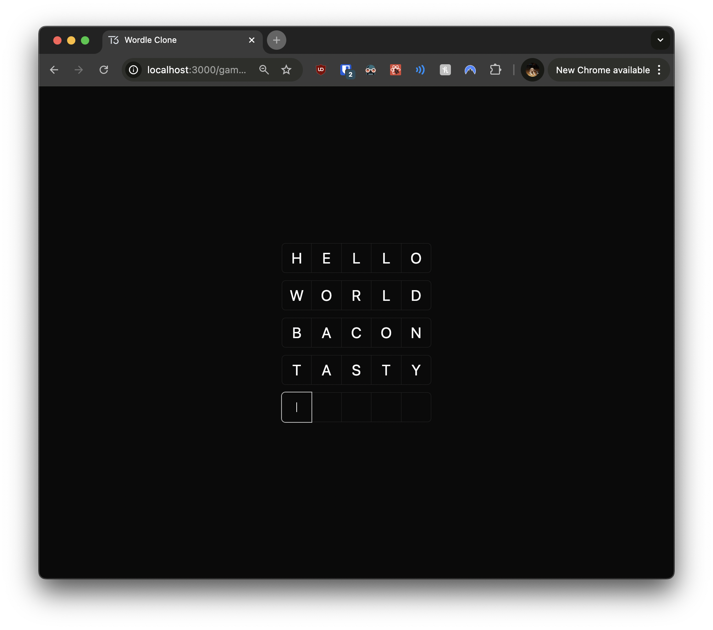

# 03: Game Logic Implementation

Welcome to the third section of the tutorial! In this section, you'll add the core game mechanics, state management, and server-side logic to make your Wordle clone fully functional. This involves implementing the game logic on both the server and client sides, similar to how you'd manage services and state in an **Angular** application with **Spring Boot** for backend services.

## Prerequisites

Before you begin, ensure you've completed the previous section or are up to date with the `checkpoint-02-game-board` branch.

**To get up to speed:**

1. **Switch to the branch:**

   ```bash
   git checkout checkpoint-02-game-board
   ```

2. **Install dependencies:**

   ```bash
   yarn install
   ```

3. **Start the development server:**

   ```bash
   yarn dev
   ```

Once you've completed these steps, you're ready to implement the game logic.

---

## Implementing Utility Functions

First, you'll implement the `getRandomWord` function to select a random word for each new game. This function is akin to a utility service in Angular that provides common functionalities across components.

> **Angular Comparison:** In Angular, you might create a shared service with methods that can be injected into components. Here, we create a utility function that can be imported where needed.

### Exercise 1: Creating the `getRandomWord` Function

Your task is to implement the `getRandomWord` function in the `utils` file. In React applications, utility functions like this are often placed in separate files and imported where needed, similar to Angular's approach of using services for shared functionality, but as plain JavaScript functions rather than injectable services.

**Instructions:**

1. **Open the `utils.ts` File:**

   Open the file `src/lib/utils.ts` in your code editor.

2. **Import the `words` Array:**

   Import the `words` array from your word list, which is located in `src/lib/words.ts`. This array contains all possible words that can be used in the game.

3. **Implement the `getRandomWord` Function:**

   Implement a function that selects and returns a random word from the `words` array.

**Hints:**

- Use `Math.random()` and `Math.floor()` to generate a random index.
- Handle the case where no word is found by throwing an error.
- Convert the selected word to uppercase for consistency.

**Starting Point:**

```typescript
// src/lib/utils.ts

import { clsx } from "clsx";
import { twMerge } from "tailwind-merge";

// TODO: Import the words array

// Utility function for combining class names
export function cn(...inputs: string[]) {
  return twMerge(clsx(inputs));
}

// TODO: Implement the getRandomWord function
export function getRandomWord() {
  // Your code here
}
```

When you're ready, check your implementation against the provided solution.

---

<details>
<summary>👉 Click here to see the solution 👈</summary>

```typescript
// src/lib/utils.ts

import { clsx } from "clsx";
import { twMerge } from "tailwind-merge";

// Import the words array
import { words } from "./words";

// Utility function for combining class names
export function cn(...inputs: string[]) {
  return twMerge(clsx(inputs));
}

// Function to get a random word from the words array
export function getRandomWord() {
  // Generate a random index based on the length of the words array
  const randomIndex = Math.floor(Math.random() * words.length);
  // Get the word at the random index
  const word = words[randomIndex];
  // If no word is found, throw an error
  if (!word) {
    throw new Error("Error retrieving random word");
  }
  // Return the word in uppercase for consistency
  return word.toUpperCase();
}
```

</details>

---

## Implementing Server-Side Logic

Next, you'll create server-side services to handle game creation, retrieval, updating, and guess management. This mirrors how you'd use services in **Spring Boot** to manage business logic and interact with the database.

> **Spring Boot Comparison:** In Spring Boot, you might create service classes annotated with `@Service` to encapsulate business logic and interact with repositories for database operations.

### Exercise 2: Creating the Game Service

Your task is to implement the game service with functions for creating, retrieving, and updating games. This service will act similarly to a backend service in a Spring Boot application, encapsulating database operations and business logic.

**Instructions:**

1. **Create the Game Service File:**

   Create a new file at `src/server/services/game.service.ts`.

2. **Implement the Following Functions:**

   - `getById`: Retrieve a game by its ID (similar to a `findById` method in a Spring Boot repository).
   - `create`: Create a new game with a random word (akin to a `save` method in a Spring Boot service).
   - `update`: Update the status of an existing game (similar to an `update` method in a Spring Boot service).

**Hints:**

- Use the `db` instance to interact with your database, much like you would use a repository in Spring Boot.
- Remember to import necessary dependencies and types.
- Use the `getRandomWord` function you created earlier for new games.
- Handle cases where a game is not found or creation fails by throwing errors.

**Starting Point:**

```typescript
// src/server/services/game.service.ts

import { eq } from "drizzle-orm";
import { getRandomWord } from "~/lib/utils";
import { db } from "../db";
import { games } from "../db/schema";

// Function to get a game by its ID
export const getById = async (id: number) => {
  // TODO: Implement function to retrieve a game by ID
};

// Function to create a new game
const create = async () => {
  // TODO: Implement function to create a new game
};

// Function to update the status of a game
export const update = async (
  id: number,
  status: (typeof games.status.enumValues)[number]
) => {
  // TODO: Implement function to update a game's status
};

// Export the gameService with the methods
export const gameService = {
  create,
  getById,
  update,
};
```

When you're ready, check your implementation against the provided solution.

---

<details>
<summary>👉 Click here to see the solution 👈</summary>

```typescript
// src/server/services/game.service.ts

import { eq } from "drizzle-orm";
import { getRandomWord } from "~/lib/utils";
import { db } from "../db";
import { games } from "../db/schema";

// Function to get a game by its ID
export const getById = async (id: number) => {
  // Query the database for the game with the specified ID
  const game = await db.query.games.findFirst({
    where: eq(games.id, id),
  });

  // If the game doesn't exist, throw an error
  if (!game) {
    throw new Error("Game not found");
  }

  return game;
};

// Function to create a new game
const create = async () => {
  // Get a random word for the new game
  const randomWord = getRandomWord();

  // Insert a new game into the database with the random word
  const [newGame] = await db
    .insert(games)
    .values({ word: randomWord, status: "in_progress" })
    .returning();

  // If the game wasn't created, throw an error
  if (!newGame) {
    throw new Error("Failed to create game");
  }

  return newGame;
};

// Function to update the status of a game
export const update = async (
  id: number,
  status: (typeof games.status.enumValues)[number]
) => {
  // Update the game status in the database
  const [updatedGame] = await db
    .update(games)
    .set({ status })
    .where(eq(games.id, id))
    .returning();

  // If the game wasn't found, throw an error
  if (!updatedGame) {
    throw new Error("Game not found");
  }

  return updatedGame;
};

// Export the gameService with the methods
export const gameService = {
  create,
  getById,
  update,
};
```

**Explanation:**

- **`getById` Function:**

  - Retrieves a game by its ID using the `db.query.games.findFirst` method.
  - Throws an error if the game is not found.

- **`create` Function:**

  - Generates a random word using `getRandomWord`.
  - Inserts a new game into the database with the word and a status of `"in_progress"`.
  - Returns the newly created game.

- **`update` Function:**
  - Updates the status of an existing game by ID.
  - Throws an error if the game is not found.

> **Spring Boot Comparison:** In Spring Boot, these methods would be part of a `GameService` class, annotated with `@Service`. Database operations would typically use a `GameRepository` interface extending `JpaRepository`.

</details>

---

### Exercise 3: Creating the Guess Service

Now, you'll implement the guess service to handle guess-related operations. This service will function similarly to a service layer in a Spring Boot application, managing business logic related to guesses.

**Instructions:**

1. **Create the Guess Service File:**

   Create a new file at `src/server/services/guess.service.ts`.

2. **Implement the Following Functions:**

   - `checkGuess`: Compare a guess against the actual word (similar to a validation method in a Spring Boot service).
   - `create`: Create a new guess and save it to the database (akin to a `save` method in a Spring Boot service).
   - `findByGameId`: Retrieve all guesses for a specific game (similar to a `findAllByGameId` method in Spring Boot).

**Hints:**

- The `checkGuess` function should return a string representing the correctness of each letter.
- Use `'C'` for correct position, `'~'` for correct letter in wrong position, and `'X'` for incorrect letters.
- Remember to revalidate the game page after creating a new guess using `revalidatePath`.
- Handle errors appropriately, similar to exception handling in a Spring Boot service.

**Starting Point:**

```typescript
// src/server/services/guess.service.ts

import { asc, eq } from "drizzle-orm";
import { revalidatePath } from "next/cache";

import { db } from "../db";
import { games, guesses } from "../db/schema";

// Function to check the guess against the actual word
const checkGuess = async (guess: string, gameId: number) => {
  // TODO: Implement logic to compare the guess with the actual word
};

// Function to create a new guess
const create = async (guess: string, gameId: number) => {
  // TODO: Implement logic to create a new guess and save it to the database
};

// Function to retrieve guesses by game ID
const findByGameId = async (gameId: number) => {
  // TODO: Implement logic to retrieve all guesses for a specific game
};

// Export the guessService with the methods
export const guessService = {
  create,
  findByGameId,
};
```

When you're ready, check your implementation against the provided solution.

---

<details>
<summary>👉 Click here to see the solution 👈</summary>

```typescript
// src/server/services/guess.service.ts

import { asc, eq } from "drizzle-orm";
import { revalidatePath } from "next/cache";

import { db } from "../db";
import { games, guesses } from "../db/schema";

// Function to check the guess against the actual word
const checkGuess = async (guess: string, gameId: number) => {
  // Retrieve the game from the database
  const game = await db.query.games.findFirst({
    where: eq(games.id, gameId),
  });

  // If the game doesn't exist, throw an error
  if (!game) {
    throw new Error("Game not found");
  }

  const actualWord = game.word.toUpperCase();
  const upperGuess = guess.toUpperCase();
  const result = new Array(5).fill("X");
  const charCount = new Map();

  // Count character occurrences in the actual word
  for (const char of actualWord) {
    charCount.set(char, (charCount.get(char) || 0) + 1);
  }

  // Check for correct letters in correct positions
  for (let i = 0; i < 5; i++) {
    if (upperGuess[i] === actualWord[i]) {
      result[i] = "C"; // Correct position
      charCount.set(upperGuess[i], charCount.get(upperGuess[i])! - 1);
    }
  }

  // Check for correct letters in wrong positions
  for (let i = 0; i < 5; i++) {
    if (result[i] !== "C" && charCount.get(upperGuess[i])! > 0) {
      result[i] = "~"; // Wrong position
      charCount.set(upperGuess[i], charCount.get(upperGuess[i])! - 1);
    }
  }

  return result.join("");
};

// Function to create a new guess
const create = async (guess: string, gameId: number) => {
  // Check the guess against the actual word
  const result = await checkGuess(guess, gameId);

  // Insert the new guess into the database
  const [createdGuess] = await db
    .insert(guesses)
    .values({
      gameId,
      guess: guess.toUpperCase(),
      result,
    })
    .returning();

  // If the guess wasn't created, throw an error
  if (!createdGuess) {
    throw new Error("Failed to create guess");
  }

  // Revalidate the game page to update the UI
  revalidatePath(`/game/${gameId}`);

  return createdGuess;
};

// Function to retrieve guesses by game ID
const findByGameId = async (gameId: number) => {
  // Query the database for guesses associated with the game ID
  return db.query.guesses.findMany({
    where: eq(guesses.gameId, gameId),
    orderBy: [asc(guesses.createdAt)],
  });
};

// Export the guessService with the methods
export const guessService = {
  create,
  findByGameId,
};
```

**Explanation:**

- **`checkGuess` Function:**

  - Retrieves the game from the database.
  - Compares the guess to the actual word, determining which letters are correct.
  - Returns a result string indicating correctness.

- **`create` Function:**

  - Uses `checkGuess` to get the result.
  - Inserts the guess into the database.
  - Revalidates the game page to update the UI.

- **`findByGameId` Function:**
  - Retrieves all guesses for a specific game, ordered by creation time.

> **Spring Boot Comparison:** In Spring Boot, you might have methods in a `GuessService` class to validate guesses and interact with a `GuessRepository`. The `checkGuess` logic would be similar to business logic methods within the service.

</details>

---

## Creating the API Layer

You'll now create an API layer that exposes these services to your components, facilitating interaction between the client and server logic. This is similar to defining controllers in a Spring Boot application.

> **Spring Boot Comparison:** Controllers in Spring Boot handle HTTP requests and delegate to service classes. In Next.js, server functions can act as controllers.

### Exercise 4: Creating the Game Controller

Your task is to create a game controller that will handle game-related API calls. This controller will act as an intermediary between your React components and the game service.

**Understanding Server Components:**

In Next.js, files in the `app` directory are **server components** by default. When you use the `"use server"` directive at the top of a file, you're indicating that functions within can only be called from server components or through special server actions.

**Instructions:**

1. **Create the Game Controller File:**

   Create a new file at `src/server/controllers/game.controller.ts`.

2. **Import the `gameService`:**

   Import the `gameService` from your services.

3. **Implement and Export the Following Functions:**

   - `create`: Create a new game.
   - `getById`: Retrieve a game by its ID.

**Hints:**

- Use the `"use server"` directive at the top of the file to indicate server-only functions.
- The controller functions should simply call the corresponding service methods.

**Starting Point:**

```typescript
// src/server/controllers/game.controller.ts

"use server";

import { gameService } from "../services/game.service";

// Controller function to create a new game
export const create = async () => {
  // TODO: Call the create function from the game service
};

// Controller function to get a game by ID
export const getById = async (id: number) => {
  // TODO: Call the getById function from the game service
};
```

When you're ready, check your implementation against the provided solution.

---

<details>
<summary>👉 Click here to see the solution 👈</summary>

```typescript
// src/server/controllers/game.controller.ts

"use server";

import { gameService } from "../services/game.service";

// Controller function to create a new game
export const create = async () => {
  // Call the create function from the game service
  return gameService.create();
};

// Controller function to get a game by ID
export const getById = async (id: number) => {
  // Call the getById function from the game service
  return gameService.getById(id);
};
```

</details>

---

### Exercise 5: Creating the Guess Controller

Now, you'll create a guess controller to handle guess-related API calls. This controller will work similarly to the game controller.

**Instructions:**

1. **Create the Guess Controller File:**

   Create a new file at `src/server/controllers/guess.controller.ts`.

2. **Import the `guessService`:**

   Import the `guessService` from your services.

3. **Implement and Export the Following Functions:**

   - `create`: Create a new guess.
   - `findByGameId`: Retrieve all guesses for a specific game.

**Hints:**

- Use the `"use server"` directive at the top of the file.
- The controller functions should directly call the corresponding service methods.

**Starting Point:**

```typescript
// src/server/controllers/guess.controller.ts

"use server";

import { guessService } from "../services/guess.service";

// Controller function to create a new guess
export const create = async (guess: string, gameId: number) => {
  // TODO: Call the create function from the guess service
};

// Controller function to find guesses by game ID
export const findByGameId = async (gameId: number) => {
  // TODO: Call the findByGameId function from the guess service
};
```

When you're ready, check your implementation against the provided solution.

---

<details>
<summary>👉 Click here to see the solution 👈</summary>

```typescript
// src/server/controllers/guess.controller.ts

"use server";

import { guessService } from "../services/guess.service";

// Controller function to create a new guess
export const create = async (guess: string, gameId: number) => {
  // Call the create function from the guess service
  return guessService.create(guess, gameId);
};

// Controller function to find guesses by game ID
export const findByGameId = async (gameId: number) => {
  // Call the findByGameId function from the guess service
  return guessService.findByGameId(gameId);
};
```

</details>

---

### Exercise 6: Consolidating the API

To organize your API controllers, you'll create an `api.ts` file.

**Instructions:**

1. **Create the API File:**

   Create a new file at `src/server/api.ts`.

2. **Import Controllers:**

   Import all the controllers you've created (game and guess controllers).

3. **Create and Export the `api` Object:**

   Group the controllers under the `api` object for easy access.

**Hints:**

- Grouping your controllers makes it easier to import and use them in your components.

**Starting Point:**

```typescript
// src/server/api.ts

// Import game and guess controllers
import * as games from "./controllers/game.controller";
import * as guesses from "./controllers/guess.controller";

// Create and export the api object
export const api = {
  games,
  guesses,
};
```

---

## Updating the Home Page

Now, you'll modify the home page to allow users to start a new game.

### Exercise 7: Implementing the New Game Button

Your task is to update the home page to include a "New Game" button that creates a new game and navigates to the game page.

**Understanding Client Components:**

In Next.js, when you need to use client-side features like state or event handlers, you create **client components**. You indicate this by adding the `"use client"` directive at the top of the file.

**Instructions:**

1. **Open the Home Page File:**

   Open `src/app/page.tsx`.

2. **Add the `"use client"` Directive:**

   Add `"use client"` at the top of the file, since we'll be using client-side hooks.

3. **Import Necessary Dependencies:**

   - `useRouter` from `next/navigation` for navigation.
   - `Button` from your UI components.
   - `api` from your server API.

4. **Implement the `HomePage` Component:**

   Create a component that renders a "New Game" button. The button's `onClick` handler should create a new game and navigate to its page.

**Hints:**

- Use the `useRouter` hook for navigation.
- The `onClick` handler should be an async function.
- Remember to handle errors appropriately.

**Starting Point:**

```typescript
// src/app/page.tsx

"use client";

import { useRouter } from "next/navigation";
import { Button } from "~/components/ui/button";
import { api } from "~/server/api";

// Home page component
export default function HomePage() {
  // TODO: Implement the component logic
  <Button
    onClick={async () => {
      // Call the API to create a new game
      // Navigate to the game page using the new game's ID
    }}
  >
    New Game
  </Button>;
}
```

When you're ready, check your implementation against the provided solution.

---

<details>
<summary>👉 Click here to see the solution 👈</summary>

```typescript
// src/app/page.tsx

"use client";

import { useRouter } from "next/navigation";
import { Button } from "~/components/ui/button";
import { api } from "~/server/api";

// Home page component
export default function HomePage() {
  const router = useRouter();

  return (
    <main className="flex h-full items-center justify-center">
      <Button
        onClick={async () => {
          // Call the API to create a new game
          const game = await api.games.create();
          // Navigate to the game page using the new game's ID
          router.push(`/game/${game.id}`);
        }}
      >
        New Game
      </Button>
    </main>
  );
}
```

</details>

---

## Updating the Game Page

Finally, you'll modify the game page to fetch and display the game's data, including previous guesses. This is similar to fetching data in a component's lifecycle method in Angular, but leveraging Next.js's server-side rendering capabilities.

### Exercise 8: Implementing the Game Page

Your task is to update the game page to fetch the game's guesses and pass them to the `GameBoard` component.

**Instructions:**

1. **Open the Game Page File:**

   Open `src/app/game/[gameId]/page.tsx`.

2. **Import Necessary Dependencies:**

   - `GameBoard` component.
   - `api` from your server API.

3. **Implement the `GamePage` Component:**

   Create an async function that fetches the guesses for the current game using `api.guesses.findByGameId(gameId)`. Then, render the `GameBoard` component with the necessary props.

**Understanding Server Components:**

By default, components in the `app` directory are server components. This means they can fetch data on the server before rendering.

**Hints:**

- Use the `params` object to access `gameId` from the URL.
- Since this is a server component, you can use async/await directly.

**Starting Point:**

```typescript
// src/app/game/[gameId]/page.tsx

import { GameBoard } from "~/components/game-board";
import { api } from "~/server/api";

// Game page component for a specific game ID
export default async function GamePage({
  params: { gameId },
}: {
  params: { gameId: number };
}) {
  // TODO: Fetch the guesses and render the GameBoard component
}
```

When you're ready, check your implementation against the provided solution.

---

<details>
<summary>👉 Click here to see the solution 👈</summary>

```typescript
// src/app/game/[gameId]/page.tsx

import { GameBoard } from "~/components/game-board";
import { api } from "~/server/api";

// Game page component for a specific game ID
export default async function GamePage({
  params: { gameId },
}: {
  params: { gameId: number };
}) {
  // Fetch the guesses for the current game using the game ID
  const guesses = await api.guesses.findByGameId(gameId);

  return (
    <div className="flex h-full items-center justify-center">
      {/* Render the GameBoard component, passing gameId and guesses as props */}
      <GameBoard gameId={gameId} guesses={guesses} />
    </div>
  );
}
```

</details>

---

## Updating the Game Components

With the server-side logic in place and the game page fetching the necessary data, it's time to update the client-side components to display the game state correctly. This involves modifying the `GameBoard`, `GuessList`, `GuessItem`, and `GuessInput` components to interact with the game data and render the guesses appropriately.

### Updating the `GameBoard` Component

The `GameBoard` component serves as the main container for the game interface. We'll update it to accept `gameId` and `guesses` as props, which will be passed down to the child components.

```typescript
// src/components/game-board.tsx

import { type api } from "~/server/api";

import { GuessInput } from "./guess-input";
import { GuessList } from "./guess-list";

type GameBoardProps = {
  gameId: number;
  guesses: Awaited<ReturnType<typeof api.guesses.findByGameId>>;
};

export const GameBoard = ({ gameId, guesses }: GameBoardProps) => {
  return (
    <div className="flex grow flex-col items-center gap-3">
      <GuessList guesses={guesses} />
      <GuessInput gameId={gameId} />
    </div>
  );
};
```

**Explanation:**

- **Importing Type Definitions:**
  - Imported `type api` from `~/server/api` to use `Awaited<ReturnType<...>>` for typing the `guesses` prop.
- **Defining Props:**
  - Created `GameBoardProps` type to include `gameId` and `guesses`.
- **Updating the Component:**
  - Modified the `GameBoard` component to accept `gameId` and `guesses` as props.
  - Removed the hardcoded `guesses` array.
  - Passed the `guesses` prop to `GuessList` and `gameId` to `GuessInput`.

### Updating the `GuessList` Component

The `GuessList` component now needs to accept the correct type of `guesses` and render them using the `GuessItem` component with the appropriate types.

```typescript
// src/components/guess-list.tsx

"use client";

import { type api } from "~/server/api";

import { GuessItem } from "./guess-item";

type GuessListProps = {
  guesses: Awaited<ReturnType<typeof api.guesses.findByGameId>>;
};

export const GuessList = ({ guesses }: GuessListProps) => {
  return (
    <div className="flex flex-col gap-3">
      {guesses.map((guess) => (
        <GuessItem key={guess.id} guess={guess} />
      ))}
    </div>
  );
};
```

**Explanation:**

- **Importing Type Definitions:**
  - Imported `type api` from `~/server/api` for type definitions.
- **Defining Props:**
  - Created `GuessListProps` type with the correct type for `guesses`.
- **Updating the Component:**
  - Modified the `GuessList` component to accept `guesses` of the appropriate type.
  - Updated the mapping over `guesses` to use `guess.id` as the key and pass the `guess` object to `GuessItem`.

### Updating the `GuessItem` Component

The `GuessItem` component will now accept the correct type of `guess` and display the guess appropriately.

```typescript
// src/components/guess-item.tsx

"use client";

import { cn } from "~/lib/utils";
import { type api } from "~/server/api";

import { InputOTP, InputOTPGroup, InputOTPSlot } from "./ui/input-otp";

type GuessItemProps = {
  guess: Awaited<ReturnType<typeof api.guesses.findByGameId>>[number];
};

const GuessItemSlot = ({ index }: { index: number }) => {
  return (
    <InputOTPSlot
      index={index}
      className={cn("h-12 w-12 text-2xl uppercase")}
    />
  );
};

export const GuessItem = ({ guess }: GuessItemProps) => {
  return (
    <InputOTP readOnly maxLength={5} value={guess.guess}>
      <InputOTPGroup>
        {[0, 1, 2, 3, 4].map((index) => (
          <GuessItemSlot key={index} index={index} />
        ))}
      </InputOTPGroup>
    </InputOTP>
  );
};
```

**Explanation:**

- **Importing Type Definitions:**
  - Imported `type api` from `~/server/api` for type definitions.
- **Defining Props:**
  - Created `GuessItemProps` type with the correct type for `guess`.
- **Updating the Component:**
  - Modified the `GuessItem` component to accept `guess` as a prop.
  - Used `guess.guess` to get the guess string to display.
  - Ensured the component displays each letter of the guess.

### Updating the `GuessInput` Component

The `GuessInput` component will now accept `gameId` as a prop and use it when creating a new guess. This allows users to submit their guesses, which will be stored in the database.

```typescript
// src/components/guess-input.tsx

"use client";

import { REGEXP_ONLY_CHARS } from "input-otp";
import { useState } from "react";

import { api } from "~/server/api";

import { InputOTP, InputOTPGroup, InputOTPSlot } from "./ui/input-otp";

type GuessInputProps = {
  gameId: number;
};

export const GuessInput = ({ gameId }: GuessInputProps) => {
  const [guess, setGuess] = useState<string>("");

  return (
    <InputOTP
      maxLength={5}
      pattern={REGEXP_ONLY_CHARS}
      value={guess}
      onChange={(value) => setGuess(value)}
      onKeyDown={async (e) => {
        if (e.key === "Enter") {
          await api.guesses.create(guess, gameId);
          setGuess("");
        }
      }}
    >
      <InputOTPGroup>
        <InputOTPSlot index={0} className="h-12 w-12 text-2xl uppercase" />
        <InputOTPSlot index={1} className="h-12 w-12 text-2xl uppercase" />
        <InputOTPSlot index={2} className="h-12 w-12 text-2xl uppercase" />
        <InputOTPSlot index={3} className="h-12 w-12 text-2xl uppercase" />
        <InputOTPSlot index={4} className="h-12 w-12 text-2xl uppercase" />
      </InputOTPGroup>
    </InputOTP>
  );
};
```

**Explanation:**

- **Defining Props:**
  - Created `GuessInputProps` type with `gameId: number`.
- **Updating the Component:**
  - Modified the `GuessInput` component to accept `gameId` as a prop.
  - Used the `useGuess` hook to manage the `guess` state.
  - In the `onKeyDown` handler:
    - When the user presses **Enter**, calls `api.guesses.create(guess, gameId)` to submit the guess.
    - Resets the `guess` state after submission.

## Checking Your Progress



Now that you've implemented the game logic, it's time to verify that everything works as expected.

**Instructions:**

1. **Start the Development Server:**

   ```bash
   yarn dev
   ```

2. **Create a New Game:**

   - Navigate to `http://localhost:3000` in your web browser.
   - You should see a "New Game" button on the home page.
   - Click the button to create a new game.
   - You should be redirected to a game page with a unique game ID (e.g., `http://localhost:3000/game/1`).

3. **Interact with the Game Board:**

   - On the game page, you should see an empty game board and an input field for entering guesses.
   - Enter a 5-letter word and press **Enter**.
   - Your guess should appear on the game board.
   - Repeat the process to make additional guesses.

4. **Data Persistence:**

   - Refresh the page to ensure that your previous guesses persist.
   - This confirms that the guesses are being stored in the database.

5. **Start Another Game:**

   - Return to the home page and create another new game.
   - Verify that each game maintains its own state and guesses.

**Expected Behavior:**

- The game board updates with each guess.
- Guesses persist after refreshing the page.
- Multiple games can be played independently.

If everything works correctly, congratulations! You've successfully implemented the core game logic for your Wordle clone.

---

## Next Steps

In the next section, we'll focus on creating an on-screen keyboard component and integrating it with the game logic to enhance the user experience. This will involve:

- **Building the Keyboard Component:**
  - Creating an interactive on-screen keyboard.
- **State Management:**
  - Updating the game state based on user interactions with the keyboard.
- **UI Feedback:**
  - Providing visual feedback for correct, incorrect, and partially correct letters.

By continuing to build on your application, you'll deepen your understanding of state management and component interaction in React, paralleling advanced techniques in Angular applications.

---

## Helpful Resources

To further enhance your understanding, you might find the following resources helpful:

1. **Next.js Server and Client Components:**

   - [Server and Client Components in Next.js](https://nextjs.org/docs/getting-started/react-essentials#server-and-client-components)
     - Learn more about the differences between server and client components.

2. **Drizzle ORM Documentation:**

   - [Drizzle ORM Docs](https://orm.drizzle.team/)
     - Comprehensive guide on using Drizzle ORM for database operations.

3. **TypeScript Handbook:**

   - [TypeScript Documentation](https://www.typescriptlang.org/docs/handbook/intro.html)
     - Deepen your understanding of TypeScript for type safety.

4. **Next.js Data Fetching:**

   - [Data Fetching in Next.js](https://nextjs.org/docs/app/building-your-application/data-fetching)
     - Learn how to fetch data on the server side in Next.js.

---
