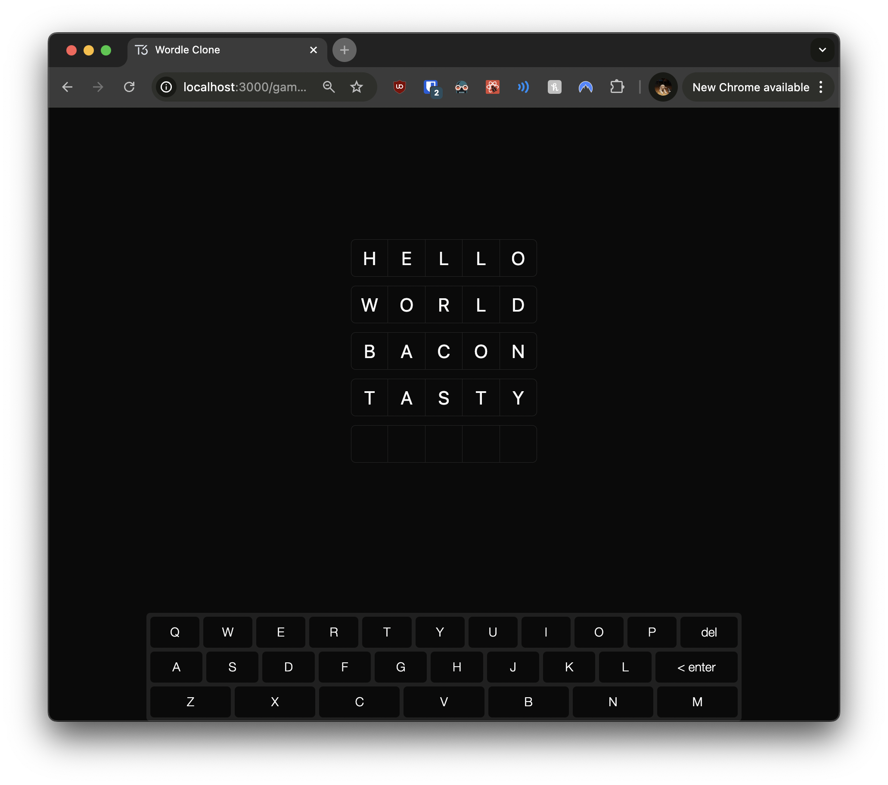

# 04: Keyboard Implementation

Welcome to the fourth section of the tutorial! In this section, you'll enhance your Wordle clone by adding an **on-screen keyboard**. This keyboard will improve the user experience by providing an alternative input method and visual feedback.

## Prerequisites

Before you begin, ensure you've completed the previous section or are up to date with the `checkpoint-03-game-logic` branch.

**To get up to speed:**

1. **Switch to the branch:**

   ```bash
   git checkout checkpoint-03-game-logic
   ```

2. **Install dependencies:**

   ```bash
   yarn install
   ```

3. **Start the development server:**

   ```bash
   yarn dev
   ```

Once you've completed these steps, you're ready to implement the on-screen keyboard.

---

## Implementing the On-Screen Keyboard

In this section, you'll add an on-screen keyboard to your game. This enhancement allows users to interact with the game without relying solely on their physical keyboard, providing a more engaging and accessible experience.

### Creating a Guess Context

To share the guess state between the `GuessInput` and `GuessKeyboard` components, we'll create a context using React's Context API. This approach enables components to share state without prop drilling.

#### Step 1: Create the Guess Context

Create a new file at `src/lib/store/guess-context.ts` and define the context type and context.

```typescript
// src/lib/store/guess-context.ts

import { createContext } from "react";

// Define the context type for better TypeScript support
export type GuessContextType = {
  guess: string;
  setGuess: (guess: string) => void;
};

// Create the GuessContext with default values
export const GuessContext = createContext<GuessContextType>({
  guess: "",
  setGuess: () => undefined, // Default function does nothing
});
```

**Explanation:**

- **GuessContextType**: Defines the shape of our context, including the `guess` string and `setGuess` function.
- **GuessContext**: Created using `createContext`, providing default values.

---

#### Step 2: Create the Guess Provider

Next, create a provider component that supplies the `GuessContext` to its child components.

Create a new file at `src/lib/store/guess-provider.tsx`:

```typescript
// src/lib/store/guess-provider.tsx

"use client";

import { useState } from "react";
import { GuessContext } from "./guess-context";

export const GuessProvider = ({ children }: { children: React.ReactNode }) => {
  // Initialize the guess state
  const [guess, setGuess] = useState<string>("");

  return (
    // Provide the guess state and setter to child components
    <GuessContext.Provider value={{ guess, setGuess }}>
      {children}
    </GuessContext.Provider>
  );
};
```

**Explanation:**

- **useState**: Manages the `guess` state within the provider.
- **GuessProvider**: Wraps its children with `GuessContext.Provider`, passing down the `guess` and `setGuess` values.

---

#### Step 3: Create a Custom Hook to Use the Guess Context

For convenience, we'll create a custom hook to consume the `GuessContext`.

Create a new file at `src/lib/hooks/use-guess.ts`:

```typescript
// src/lib/hooks/use-guess.ts

import { useContext } from "react";
import { GuessContext } from "../store/guess-context";

export const useGuess = () => {
  // Access the GuessContext values
  return useContext(GuessContext);
};
```

**Explanation:**

- **useGuess**: A custom hook that returns the context value, simplifying access to the shared `guess` state.

---

### Installing Required Dependencies

Before we create the on-screen keyboard component, we'll install the `react-simple-keyboard` library, which provides a customizable on-screen keyboard component.

**Install the package:**

```bash
yarn add react-simple-keyboard
```

**Explanation:**

- This library provides a pre-built keyboard component that we can customize and integrate into our application.

---

### Creating the GuessKeyboard Component

Now, we'll create the `GuessKeyboard` component, which will render the on-screen keyboard and handle user interactions.

Create a new file at `src/components/guess-keyboard.tsx`:

```typescript
// src/components/guess-keyboard.tsx

"use client";

import "react-simple-keyboard/build/css/index.css"; // Import the keyboard CSS

import Keyboard from "react-simple-keyboard";

import { useGuess } from "~/lib/hooks/use-guess";
import { api } from "~/server/api";

type GuessKeyboardProps = {
  gameId: number;
};

export const GuessKeyboard = ({ gameId }: GuessKeyboardProps) => {
  const { guess, setGuess } = useGuess(); // Access the shared guess state

  return (
    <Keyboard
      theme="hg-theme-default !bg-secondary/75"
      buttonTheme={[
        {
          class:
            "!bg-background !text-foreground !border-none !shadow-none hover:!bg-secondary/50 active:!bg-white/25",
          buttons:
            "Q W E R T Y U I O P A S D F G H J K L Z X C V B N M {bksp} {enter}",
        },
      ]}
      layout={{
        default: [
          "Q W E R T Y U I O P {bksp}",
          "A S D F G H J K L {enter}",
          "Z X C V B N M",
        ],
      }}
      onKeyPress={async (input) => {
        if (input === "{bksp}") {
          // Handle backspace: remove last character from guess
          setGuess(guess.slice(0, -1));
          return;
        }

        if (input === "{enter}") {
          // Handle enter: submit the guess
          await api.guesses.create(guess, gameId);
          // Clear the guess after submission
          setGuess("");
          return;
        }

        if (guess.length === 5) {
          // Prevent adding more than 5 characters
          return;
        }

        // Append the input character to the guess
        setGuess(guess + input);
      }}
    />
  );
};
```

**Explanation of Changes:**

- **Import Statements**:
  - Imported `Keyboard` component and its CSS styles.
  - Imported `useGuess` hook to access and update the shared guess state.
- **Accessing Shared State**:
  - Used `const { guess, setGuess } = useGuess();` to access the guess state.
- **onKeyPress Handler**:
  - **Backspace (`{bksp}`)**: Removes the last character from the guess.
  - **Enter (`{enter}`)**: Submits the guess to the server using `api.guesses.create`.
  - **Character Input**: Appends the character to the guess if the length is less than 5.

---

### Updating the Game Page

Now, we'll update the game page to include the `GuessProvider` and the `GuessKeyboard` component. This ensures that the `guess` state is shared across the necessary components.

Open `src/app/game/[gameId]/page.tsx` and make the following changes:

```typescript
// src/app/game/[gameId]/page.tsx

import { GameBoard } from "~/components/game-board";
import { GuessKeyboard } from "~/components/guess-keyboard"; // Import GuessKeyboard
import { GuessProvider } from "~/lib/store/guess-provider"; // Import GuessProvider
import { api } from "~/server/api";

export default async function GamePage({
  params: { gameId },
}: {
  params: { gameId: number };
}) {
  const guesses = await api.guesses.findByGameId(gameId);

  return (
    // Wrap the content with GuessProvider to share the guess state
    <GuessProvider>
      <div className="flex h-full flex-col items-center gap-6">
        <div className="flex flex-1 items-center justify-center">
          <GameBoard gameId={gameId} guesses={guesses} />
        </div>
        <div className="flex w-full max-w-3xl items-center">
          {/* Add the GuessKeyboard component */}
          <GuessKeyboard gameId={gameId} />
        </div>
      </div>
    </GuessProvider>
  );
}
```

**Explanation of Changes:**

- **Imports**:
  - Added imports for `GuessKeyboard` and `GuessProvider`.
- **GuessProvider**:
  - Wrapped the main content inside `<GuessProvider>` to provide the guess context to child components.
- **GuessKeyboard**:
  - Added `<GuessKeyboard>` component below the `GameBoard`.
- **Layout Adjustments**:
  - Used Tailwind CSS classes to adjust the layout and spacing.

---

### Updating the GameBoard Component

We'll adjust the `GameBoard` component to fit within the new layout and ensure it uses the shared `guess` state.

Open `src/components/game-board.tsx` and make the following changes:

```typescript
// src/components/game-board.tsx

import { type api } from "~/server/api";
import { GuessInput } from "./guess-input";
import { GuessList } from "./guess-list";

type GameBoardProps = {
  gameId: number;
  guesses: Awaited<ReturnType<typeof api.guesses.findByGameId>>;
};

export const GameBoard = ({ gameId, guesses }: GameBoardProps) => {
  return (
    // Adjust the layout with flexbox and spacing
    <div className="flex grow flex-col items-center gap-3">
      <GuessList guesses={guesses} />
      {/* Ensure GuessInput receives gameId */}
      <GuessInput gameId={gameId} />
    </div>
  );
};
```

**Explanation of Changes:**

- **Layout Adjustments**:
  - Added Tailwind CSS classes (`flex`, `grow`, `flex-col`, `items-center`, `gap-3`) to adjust the component's layout.
- **Component Structure**:
  - Ensured that `GuessInput` receives the `gameId` prop for guess submission.

---

### Updating the GuessInput Component

Modify the `GuessInput` component to use the shared guess state from the context, ensuring synchronization with the on-screen keyboard.

Open `src/components/guess-input.tsx` and update it as follows:

```typescript
// src/components/guess-input.tsx

"use client";

import { REGEXP_ONLY_CHARS } from "input-otp";

import { useGuess } from "~/lib/hooks/use-guess"; // Import useGuess hook
import { api } from "~/server/api";

import { InputOTP, InputOTPGroup, InputOTPSlot } from "./ui/input-otp";

type GuessInputProps = {
  gameId: number;
};

export const GuessInput = ({ gameId }: GuessInputProps) => {
  const { guess, setGuess } = useGuess(); // Use the shared guess state

  return (
    <InputOTP
      maxLength={5}
      pattern={REGEXP_ONLY_CHARS}
      value={guess} // Bind the input value to the shared guess state
      onChange={(value) => setGuess(value)} // Update the shared guess state on change
      onKeyDown={async (e) => {
        if (e.key === "Enter") {
          // Handle Enter key: submit the guess
          await api.guesses.create(guess, gameId);
          // Clear the guess after submission
          setGuess("");
        }
      }}
    >
      <InputOTPGroup>
        {[0, 1, 2, 3, 4].map((_, index) => (
          <InputOTPSlot
            key={index}
            index={index}
            className="h-12 w-12 text-2xl uppercase"
          />
        ))}
      </InputOTPGroup>
    </InputOTP>
  );
};
```

**Explanation of Changes:**

- **State Management**:
  - Removed local `useState` for `guess`.
  - Used `useGuess` hook to access the shared `guess` state.
- **Binding to Shared State**:
  - The `value` prop of `InputOTP` is now bound to the shared `guess`.
  - The `onChange` handler updates the shared `guess` state using `setGuess`.
- **Submitting Guesses**:
  - The `onKeyDown` handler submits the guess when the Enter key is pressed, using the shared `guess`.

---

## Checking Your Progress



Now that you've implemented the on-screen keyboard and updated the components, it's time to test your application.

**Instructions:**

1. **Start the Development Server:**

   ```bash
   yarn dev
   ```

2. **Navigate to a Game:**

   - Open your browser and go to `http://localhost:3000`.
   - Start a new game or continue an existing one.

3. **Verify the Keyboard Presence:**

   - On the game page, you should see the on-screen keyboard below the game board.
   - The keyboard should display the correct layout.

4. **Test Keyboard Functionality:**

   - **On-Screen Keyboard:**
     - Click on letter keys; the letters should appear in the input field above.
     - Use the `{bksp}` key to remove letters.
     - Use the `{enter}` key to submit a guess.
   - **Physical Keyboard:**
     - Typing on your physical keyboard should also update the input field.

5. **Check Guess Synchronization:**

   - Ensure that the input field reflects input from both the on-screen and physical keyboards.
   - The `GuessInput` component should display the current guess.

6. **Verify Guess Submission:**

   - After submitting a guess, it should appear on the game board.
   - The guess should be stored in the database and persist after refreshing the page.

**Expected Behavior:**

- The on-screen keyboard and physical keyboard inputs should be synchronized.
- Guesses should be submitted correctly and displayed on the game board.
- The shared `guess` state should work seamlessly across components.

---

## Next Steps

In the next section, we'll focus on adding visual feedback for guesses and implementing game-over conditions. This will involve:

- **Enhancing the UI:**

  - Providing color-coded feedback for correct and incorrect letters, similar to the original Wordle game.

- **Game Logic:**
  - Determining when the game is won or lost.
  - Handling game-over scenarios and displaying appropriate messages.

---

## Helpful Resources

To further enhance your understanding, you might find the following resources helpful:

1. **react-simple-keyboard Documentation:**

   - [Official Documentation](https://hodgef.com/simple-keyboard/)
     - Learn about customizing the keyboard layout and styling.

2. **React Context API:**

   - [React Context Documentation](https://react.dev/learn/passing-data-deeply-with-context)
     - Understand how context provides a way to pass data through the component tree.

3. **Using Custom Hooks:**

   - [Building Your Own Hooks](https://react.dev/learn/reusing-logic-with-custom-hooks)
     - Learn how to create reusable logic with custom hooks.
