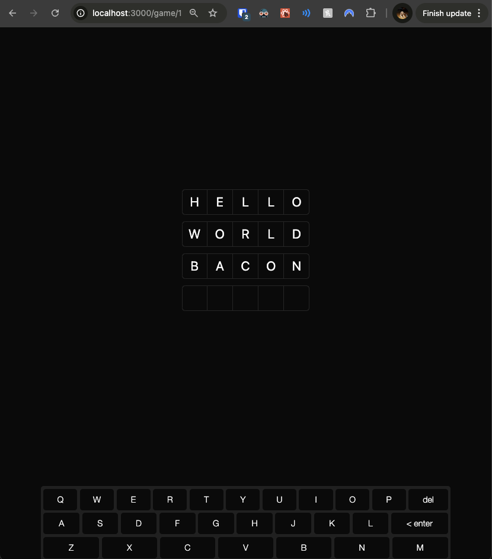

# 04: Keyboard Implementation

Welcome to the fourth section of our tutorial! In this section, you'll enhance your Wordle clone by adding an **on-screen keyboard**. This keyboard will improve the user experience by providing an alternative input method and visual feedback, similar to how you might enhance an Angular application with additional UI components.

## Prerequisites

Before you begin, ensure you've completed the previous section or are up to date with the `checkpoint-03-game-logic` branch.

**To get up to speed:**

1. **Switch to the branch:**

   ```bash
   git checkout checkpoint-03-game-logic
   ```

2. **Install dependencies:**

   ```bash
   yarn install
   ```

3. **Start the development server:**

   ```bash
   yarn dev
   ```

Once you've completed these steps, you're ready to implement the on-screen keyboard.

---

## Implementing the On-Screen Keyboard

In this section, you'll add an on-screen keyboard to your game. This enhancement is akin to adding a new component in Angular and managing shared state across components. The keyboard will allow users to interact with the game without relying solely on their physical keyboard, providing a more engaging and accessible experience.

### Exercise 1: Installing Required Dependencies

Your task is to install the `react-simple-keyboard` library, which provides a customizable on-screen keyboard component.

**Instructions:**

1. Open your terminal.
2. Run the following command to install `react-simple-keyboard`:

```bash
yarn add react-simple-keyboard
```

**Hints:**

- After installation, you can import and use the `Keyboard` component from this library in your React components, similar to how you might import and use Angular Material components in an Angular project.
- This approach of using third-party libraries for complex UI components is common in React, just as it is in Angular development.

Helpful resource:

- [react-simple-keyboard Documentation](https://hodgef.com/simple-keyboard/documentation/)

---

### Exercise 2: Creating the GuessKeyboard Component

Now, you'll create the `GuessKeyboard` component, which will render the on-screen keyboard and handle user interactions.

**Instructions:**

1. Create a new file at `src/components/guess-keyboard.tsx`.
2. Import the necessary dependencies, including the `Keyboard` component from `react-simple-keyboard`.
3. Implement the `GuessKeyboard` component with the following features:
   - Render the `Keyboard` component with appropriate props.
   - Handle key presses for letter input, deletion, and guess submission.
   - Use the `useGuess` hook (which we'll create later) to manage the current guess state.

**Hints:**

- Remember to import the CSS for `react-simple-keyboard`, similar to how you'd import styles in an Angular component.
- Use the `onKeyPress` prop of the `Keyboard` component to handle key presses. This is analogous to using `(click)` or `(keydown)` event bindings in Angular templates.
- The `useGuess` hook will function similarly to how you might use a shared service in Angular to manage state across components.

Here's a starting point for your `GuessKeyboard` component:

```typescript
// src/components/guess-keyboard.tsx

"use client";

import "react-simple-keyboard/build/css/index.css";

import Keyboard from "react-simple-keyboard";

import { useGuess } from "~/lib/hooks/use-guess";
import { api } from "~/server/api";

type GuessKeyboardProps = {
  gameId: number;
};

export const GuessKeyboard = ({ gameId }: GuessKeyboardProps) => {
  const { guess, setGuess } = useGuess();

  // TODO: Implement the Keyboard component with appropriate props
  // TODO: Handle key presses in the onKeyPress callback
};
```

When you're ready, check your implementation against the provided solution.

---

<details>
<summary>👉 Click here to see the solution 👈</summary>

```typescript
// src/components/guess-keyboard.tsx

"use client";

import "react-simple-keyboard/build/css/index.css";

import Keyboard from "react-simple-keyboard";

import { useGuess } from "~/lib/hooks/use-guess";
import { api } from "~/server/api";

type GuessKeyboardProps = {
  gameId: number;
};

export const GuessKeyboard = ({ gameId }: GuessKeyboardProps) => {
  const { guess, setGuess } = useGuess();

  return (
    <Keyboard
      theme="hg-theme-default !bg-secondary/75"
      buttonTheme={[
        {
          class:
            "!bg-background !text-foreground !border-none !shadow-none hover:!bg-secondary/50 active:!bg-white/25",
          buttons:
            "Q W E R T Y U I O P A S D F G H J K L Z X C V B N M {delete} {enter}",
        },
      ]}
      layout={{
        default: [
          "Q W E R T Y U I O P {delete}",
          "A S D F G H J K L {enter}",
          "Z X C V B N M",
        ],
      }}
      onKeyPress={async (input) => {
        if (input === "{delete}") {
          // Remove the last character from the guess
          setGuess(guess.slice(0, -1));
          return;
        }

        if (input === "{enter}") {
          // Submit the guess to the server
          await api.guesses.create(guess, gameId);
          // Clear the guess after submission
          setGuess("");
          return;
        }

        if (guess.length === 5) {
          // Prevent adding more than 5 characters
          return;
        }

        // Append the input character to the guess
        setGuess(guess + input);
      }}
    />
  );
};
```

</details>

---

### Exercise 3: Creating a Guess Context

To share the guess state between the `GuessInput` and `GuessKeyboard` components, you'll create a context using React's Context API. This approach is similar to using services in Angular to share data across components without prop drilling.

**Instructions:**

1. Create a new file at `src/lib/store/guess-context.ts`.
2. Define a `GuessContextType` that includes the current guess and a function to update it.
3. Create and export a `GuessContext` using `createContext`.

**Hints:**

- The `createContext` function in React is similar to creating an injectable service in Angular, providing a way to share state across components.
- The context should have a default value that matches the shape of `GuessContextType`.

Here's a starting point for your guess context:

```typescript
// src/lib/store/guess-context.ts

import { createContext } from "react";

// TODO: Define GuessContextType

// TODO: Create and export GuessContext
```

When you're ready, check your implementation against the provided solution.

---

<details>
<summary>👉 Click here to see the solution 👈</summary>

```typescript
// src/lib/store/guess-context.ts

import { createContext } from "react";

// Define the context type
export type GuessContextType = {
  guess: string;
  setGuess: (guess: string) => void;
};

// Create the GuessContext with default values
export const GuessContext = createContext<GuessContextType>({
  guess: "",
  setGuess: () => undefined,
});
```

</details>

---

### Exercise 4: Creating a GuessProvider

Next, you'll create a provider component that supplies the `GuessContext` to its child components. This is akin to providing a service in Angular that can be injected where needed.

**Instructions:**

1. Create a new file at `src/lib/store/guess-provider.tsx`.
2. Import the necessary dependencies, including the `GuessContext` you just created.
3. Implement a `GuessProvider` component that manages the guess state and provides it to its children.

**Hints:**

- Use the `useState` hook to manage the `guess` state. This is similar to using component state in Angular, but with React's functional component approach.
- The provider component should wrap its children with `GuessContext.Provider`, passing the current state and update function as the context value.

Here's a starting point for your `GuessProvider`:

```typescript
// src/lib/store/guess-provider.tsx

"use client";

import { useState } from "react";
import { GuessContext } from "./guess-context";

// TODO: Implement the GuessProvider component
```

When you're ready, check your implementation against the provided solution.

---

<details>
<summary>👉 Click here to see the solution 👈</summary>

```typescript
// src/lib/store/guess-provider.tsx

"use client";

import { useState } from "react";
import { GuessContext } from "./guess-context";

export const GuessProvider = ({ children }: { children: React.ReactNode }) => {
  const [guess, setGuess] = useState<string>("");

  return (
    <GuessContext.Provider value={{ guess, setGuess }}>
      {children}
    </GuessContext.Provider>
  );
};
```

</details>

---

### Exercise 5: Creating a useGuess Hook

For convenience, you'll create a custom hook to consume the `GuessContext`. This is similar to creating a custom service in Angular for state management.

**Instructions:**

1. Create a new file at `src/lib/hooks/use-guess.ts`.
2. Import the necessary dependencies, including the `GuessContext`.
3. Implement and export a `useGuess` hook that returns the context value.

**Hints:**

- Use the `useContext` hook to access the `GuessContext`. This is conceptually similar to injecting a service in Angular, but uses React's hooks system.
- The custom hook pattern in React allows for reusable logic across components, similar to how you might use services in Angular for shared functionality.

Here's a starting point for your `useGuess` hook:

```typescript
// src/lib/hooks/use-guess.ts

import { useContext } from "react";
import { GuessContext } from "../store/guess-context";

// TODO: Implement and export the useGuess hook
```

When you're ready, check your implementation against the provided solution.

---

<details>
<summary>👉 Click here to see the solution 👈</summary>

```typescript
// src/lib/hooks/use-guess.ts

import { useContext } from "react";
import { GuessContext } from "../store/guess-context";

export const useGuess = () => {
  return useContext(GuessContext);
};
```

</details>

---

### Exercise 6: Updating the Game Page

Now, you'll update the game page to include the `GuessProvider` and the `GuessKeyboard` component. This ensures that the `guess` state is shared across the necessary components.

**Instructions:**

1. Open `src/app/game/[gameId]/page.tsx`.
2. Import the `GuessProvider` and `GuessKeyboard` components.
3. Wrap the existing content with `GuessProvider`.
4. Add the `GuessKeyboard` component below the `GameBoard`.

**Hints:**

- The `GuessProvider` wrapping is similar to how you might provide a service at a component level in Angular.
- Adjust the layout to accommodate the new keyboard component, using Tailwind CSS classes for styling.

Here's a starting point for your updated game page:

```typescript
// src/app/game/[gameId]/page.tsx

import { GameBoard } from "~/components/game-board";
// TODO: Import GuessKeyboard and GuessProvider
import { api } from "~/server/api";

export default async function GamePage({
  params: { gameId },
}: {
  params: { gameId: number };
}) {
  const guesses = await api.guesses.findByGameId(gameId);

  return (
    // TODO: Wrap with GuessProvider
    // TODO: Adjust layout and add GuessKeyboard
  );
}
```

When you're ready, check your implementation against the provided solution.

---

<details>
<summary>👉 Click here to see the solution 👈</summary>

```typescript
// src/app/game/[gameId]/page.tsx

import { GameBoard } from "~/components/game-board";
import { GuessKeyboard } from "~/components/guess-keyboard";
import { GuessProvider } from "~/lib/store/guess-provider";
import { api } from "~/server/api";

export default async function GamePage({
  params: { gameId },
}: {
  params: { gameId: number };
}) {
  const guesses = await api.guesses.findByGameId(gameId);

  return (
    <GuessProvider>
      <div className="flex h-full flex-col items-center gap-6">
        <div className="flex flex-1 items-center justify-center">
          <GameBoard gameId={gameId} guesses={guesses} />
        </div>
        <div className="flex w-full max-w-3xl items-center">
          <GuessKeyboard gameId={gameId} />
        </div>
      </div>
    </GuessProvider>
  );
}
```

</details>

---

### Exercise 7: Updating the GameBoard Component

You'll adjust the `GameBoard` component to better align within the new layout and ensure it uses the shared `guess` state.

**Instructions:**

1. Open `src/components/game-board.tsx`.
2. Adjust the component's layout to fit within the new page structure.
3. Ensure the `GuessInput` component receives the `gameId` prop.

**Hints:**

- Use Tailwind CSS classes to adjust the layout, similar to how you might use CSS classes in Angular templates.
- The changes here are mostly structural to accommodate the new keyboard layout.

Here's a starting point for your updated `GameBoard` component:

```typescript
// src/components/game-board.tsx

import { type api } from "~/server/api";
import { GuessInput } from "./guess-input";
import { GuessList } from "./guess-list";

type GameBoardProps = {
  gameId: number;
  guesses: Awaited<ReturnType<typeof api.guesses.findByGameId>>;
};

export const GameBoard = ({ gameId, guesses }: GameBoardProps) => {
  // TODO: Adjust the layout
  return (
    // TODO: Update component structure
  );
};
```

When you're ready, check your implementation against the provided solution.

---

<details>
<summary>👉 Click here to see the solution 👈</summary>

```typescript
// src/components/game-board.tsx

import { type api } from "~/server/api";
import { GuessInput } from "./guess-input";
import { GuessList } from "./guess-list";

type GameBoardProps = {
  gameId: number;
  guesses: Awaited<ReturnType<typeof api.guesses.findByGameId>>;
};

export const GameBoard = ({ gameId, guesses }: GameBoardProps) => {
  return (
    <div className="flex grow flex-col items-center gap-3">
      <GuessList guesses={guesses} />
      <GuessInput gameId={gameId} />
    </div>
  );
};
```

</details>

---

### Exercise 8: Updating the GuessInput Component

Modify the `GuessInput` component to use the shared guess state from the context, ensuring synchronization with the on-screen keyboard.

**Instructions:**

1. Open `src/components/guess-input.tsx`.
2. Replace the local state management with the `useGuess` hook.
3. Update the component to use the shared `guess` state and `setGuess` function.

**Hints:**

- The `useGuess` hook replaces the need for local state, similar to how you might inject a shared service in Angular.
- Ensure the `onKeyDown` handler updates the shared state and submits guesses using the API.

Here's a starting point for your updated `GuessInput` component:

```typescript
// src/components/guess-input.tsx

"use client";

import { REGEXP_ONLY_CHARS } from "input-otp";

import { useGuess } from "~/lib/hooks/use-guess";
import { api } from "~/server/api";

import { InputOTP, InputOTPGroup, InputOTPSlot } from "./ui/input-otp";

type GuessInputProps = {
  gameId: number;
};

export const GuessInput = ({ gameId }: GuessInputProps) => {
  // TODO: Replace useState with useGuess hook
  // TODO: Update component to use shared guess state
};
```

When you're ready, check your implementation against the provided solution.

---

<details>
<summary>👉 Click here to see the solution 👈</summary>

```typescript
// src/components/guess-input.tsx

"use client";

import { REGEXP_ONLY_CHARS } from "input-otp";

import { useGuess } from "~/lib/hooks/use-guess";
import { api } from "~/server/api";

import { InputOTP, InputOTPGroup, InputOTPSlot } from "./ui/input-otp";

type GuessInputProps = {
  gameId: number;
};

export const GuessInput = ({ gameId }: GuessInputProps) => {
  const { guess, setGuess } = useGuess();

  return (
    <InputOTP
      maxLength={5}
      pattern={REGEXP_ONLY_CHARS}
      value={guess}
      onChange={(value) => setGuess(value)}
      onKeyDown={async (e) => {
        if (e.key === "Enter") {
          // Submit the guess to the server
          await api.guesses.create(guess, gameId);
          // Clear the guess after submission
          setGuess("");
        }
      }}
    >
      <InputOTPGroup>
        {[...Array(5)].map((_, index) => (
          <InputOTPSlot
            key={index}
            index={index}
            className="h-12 w-12 text-2xl uppercase"
          />
        ))}
      </InputOTPGroup>
    </InputOTP>
  );
};
```

</details>

---

## Checking Your Progress

Now that you've implemented the on-screen keyboard and updated the components, it's time to test your application. Testing ensures that all components work together seamlessly and that the user experience is as intended.

**Instructions:**

1. **Start the Development Server:**

   ```bash
   yarn dev
   ```

2. **Navigate to a Game:**

   - Open your browser and go to `http://localhost:3000`.
   - Start a new game or continue an existing one.

3. **Verify the Keyboard Presence:**

   

   - On the game page, you should see the on-screen keyboard below the game board.
   - The keyboard should display the correct layout.

4. **Test Keyboard Functionality:**

   - **On-Screen Keyboard:**
     - Click on letter keys; the letters should appear in the input field above.
     - Use the `{delete}` key to remove letters.
     - Use the `{enter}` key to submit a guess.
   - **Physical Keyboard:**
     - Typing on your physical keyboard should also update the input field.

5. **Check Guess Synchronization:**

   - Ensure that the input field reflects input from both the on-screen and physical keyboards.
   - The `GuessInput` component should display the current guess.

6. **Verify Guess Submission:**

   - After submitting a guess, it should appear on the game board.
   - The guess should be stored in the database and persist after refreshing the page.

If everything works as expected, congratulations! You've successfully enhanced your Wordle clone with an on-screen keyboard, providing an improved user experience.

This implementation demonstrates how React's component-based architecture and context API can be used to create interactive, stateful UI elements. The separation of concerns between the keyboard component, input component, and shared state management is similar to how you might structure an Angular application with components and services, but leverages React's more flexible and lightweight approach to state management.

---

## Next Steps

In the next section, we'll focus on adding visual feedback for guesses and implementing game-over conditions. This will involve:

- **Enhancing the UI:**
  - Providing color-coded feedback for correct and incorrect letters, similar to the original Wordle game.
- **Game Logic:**
  - Determining when the game is won or lost.
  - Handling game-over scenarios and displaying appropriate messages.

By continuing to build on your application, you'll gain a deeper understanding of state management and component interaction in React, paralleling advanced techniques in Angular applications.

---

## Helpful Resources

To further enhance your understanding, you might find the following resources helpful:

1. **react-simple-keyboard Documentation:**

   - [Official Documentation](https://hodgef.com/simple-keyboard/)
     - Learn about customizing the keyboard layout and styling.

2. **React Context API:**

   - [React Context Documentation](https://react.dev/learn/passing-data-deeply-with-context)
     - Understand how context provides a way to pass data through the component tree.

3. **Using Custom Hooks:**

   - [Building Your Own Hooks](https://react.dev/learn/reusing-logic-with-custom-hooks)
     - Learn how to create reusable logic with custom hooks.

---
