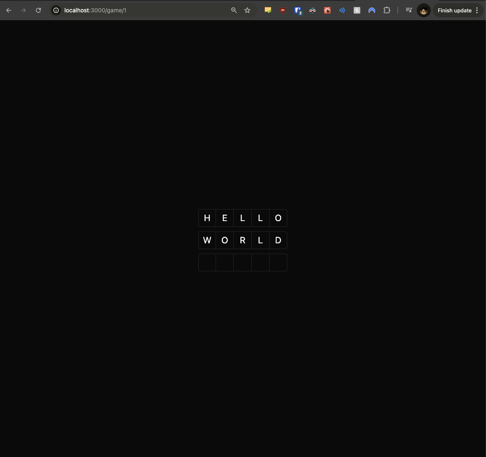
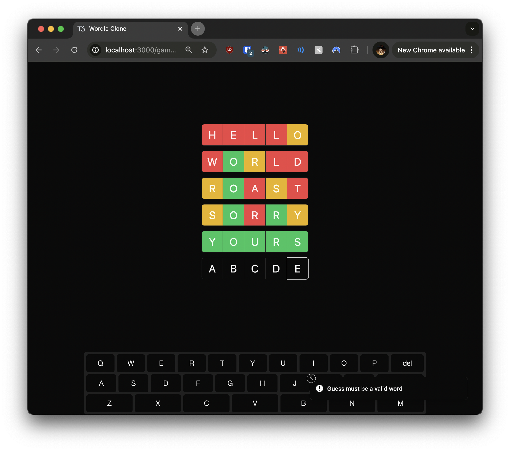

# 05: Word Validation

Welcome to the fifth section of the tutorial! In this section, you'll enhance your Wordle clone by implementing **word validation** and improving user feedback. This will ensure that users can only submit valid guesses, enhancing the game's integrity and providing a better user experience. Additionally, you'll add error notifications to inform users when their guesses are invalid, similar to form validation feedback in Angular applications.

## Prerequisites

Before you begin, ensure you've completed the previous section or are up to date with the `checkpoint-04-keyboard` branch.

**To get up to speed:**

1. **Switch to the branch:**

   ```bash
   git checkout checkpoint-04-keyboard
   ```

2. **Install dependencies:**

   ```bash
   yarn install
   ```

3. **Start the development server:**

   ```bash
   yarn dev
   ```

Once you've completed these steps, you're ready to implement word validation.

---

## Implementing Word Validation

In this section, you'll add functionality to validate user guesses against a predefined word list. This ensures that only legitimate words are accepted, preventing users from entering random letters or gibberish. Just like form validation in Angular, this step is crucial for maintaining the integrity of the application's data and providing meaningful feedback to the user.

### Adding Toast Notifications

First, we'll integrate a toast notification system into your application. This will allow you to display error messages in a non-intrusive way, similar to how you might use Angular's snackbar or toast components.

#### Step 1: Importing and Adding the Toaster Component

Open `src/app/layout.tsx` and make the following changes:

```typescript
// src/app/layout.tsx

import "~/styles/globals.css";

import { GeistSans } from "geist/font/sans";
import { type Metadata } from "next";

// Import the Toaster component for notifications
import { Toaster } from "~/components/ui/sonner";

export const metadata: Metadata = {
  title: "Wordle Clone",
  description: "Our awesome Wordle clone",
};

export default function RootLayout({
  children,
}: Readonly<{ children: React.ReactNode }>) {
  return (
    <html lang="en" className={`${GeistSans.variable} dark`}>
      <body className="h-screen">{children}</body>
      {/* Add the Toaster component to display toast notifications */}
      <Toaster closeButton={true} expand={true} visibleToasts={4} />
    </html>
  );
}
```

**Explanation:**

- **Import Statements:**
  - Imported the `Toaster` component from `~/components/ui/sonner`.
- **Adding the Toaster:**
  - Placed the `<Toaster>` component inside the `<html>` tag but outside the `<body>` tag. This ensures it's available throughout your application.
  - Configured the `Toaster` with `closeButton`, `expand`, and `visibleToasts` props to customize its behavior.

---

### Implementing the Word Validation Function

Next, we'll create a function to check if a given word is valid according to your word list. This is similar to creating a validator function in Angular forms.

#### Step 1: Creating the `isValidWord` Function

Open `src/lib/utils.ts` and add the following code:

```typescript
// src/lib/utils.ts

import { type ClassValue, clsx } from "clsx";
import { twMerge } from "tailwind-merge";

// Import your list of valid words
import { words } from "./words";

export function cn(...inputs: ClassValue[]) {
  return twMerge(clsx(inputs));
}

export function getRandomWord() {
  const randomIndex = Math.floor(Math.random() * words.length);
  const word = words[randomIndex];
  if (!word) {
    throw new Error("Error retrieving random word");
  }
  return word;
}

// Function to check if a word is valid
export function isValidWord(word: string): boolean {
  return words.includes(word.toLowerCase());
}
```

**Explanation:**

- **Import Statements:**
  - Imported the `words` array from `./words`, which contains your list of valid words.
- **`isValidWord` Function:**
  - Accepts a `word` parameter.
  - Converts the input word to lowercase to ensure case-insensitive validation.
  - Checks if the lowercase word is included in the `words` array.
  - Returns a boolean indicating whether the word is valid.

---

### Creating a Custom Hook for Guess Creation

We'll develop a custom hook called `useCreateGuess` to handle guess creation with validation and error handling. This centralizes the logic, much like an Angular service would for form submission and validation.

#### Step 1: Implementing the `useCreateGuess` Hook

Create a new file at `src/lib/hooks/use-create-guess.ts` and add the following code:

```typescript
// src/lib/hooks/use-create-guess.ts

import { REGEXP_ONLY_CHARS } from "input-otp";
import { toast } from "sonner";
import { z } from "zod";

import { api } from "~/server/api";

import { isValidWord } from "../utils";
import { useGuess } from "./use-guess";

// Define the validation schema using zod
const CreateGuessSchema = z.object({
  guess: z
    .string()
    .length(5, "Guess must be 5 characters long")
    .refine((value) => new RegExp(REGEXP_ONLY_CHARS).test(value), {
      message: "Guess must contain only letters",
    })
    .refine((value) => isValidWord(value), {
      message: "Guess must be a valid word",
    }),
  gameId: z.union([z.string(), z.number()]).transform((value) => Number(value)),
});

// Custom hook for creating a guess with validation
export const useCreateGuess = () => {
  const { setGuess } = useGuess();

  return async (guess: string, gameId: number) => {
    // Validate the input data against the schema
    const result = CreateGuessSchema.safeParse({ guess, gameId });
    if (!result.success) {
      // If validation fails, display error messages using toast notifications
      result.error.errors.forEach((error) => {
        toast.error(error.message);
      });
      return;
    }
    // If validation passes, create the guess using the API
    await api.guesses.create(guess, gameId);
    // Clear the current guess after submission
    setGuess("");
  };
};
```

**Explanation:**

- **Import Statements:**
  - Imported necessary modules including `zod` for validation, `toast` for notifications, and the `useGuess` hook.
- **Validation Schema:**
  - Defined `CreateGuessSchema` using `z.object` from `zod`.
  - Validates that the `guess`:
    - Is a string of exactly 5 characters.
    - Contains only letters, using `REGEXP_ONLY_CHARS`.
    - Is a valid word, using the `isValidWord` function.
  - Validates that `gameId` is a number, converting it if necessary.
- **`useCreateGuess` Hook:**
  - Uses the `useGuess` hook to access `setGuess`.
  - Returns an async function that:
    - Validates the input against the schema.
    - Displays error messages using `toast` if validation fails.
    - Submits the guess via `api.guesses.create` if validation passes.
    - Clears the current guess after submission.

---

### Updating the `GuessInput` Component

We'll modify the `GuessInput` component to use the `useCreateGuess` hook for submitting guesses. This ensures that all guesses entered via the input field are validated and handled consistently.

#### Step 1: Using the `useCreateGuess` Hook in `GuessInput`

Open `src/components/guess-input.tsx` and update it as follows:

```typescript
// src/components/guess-input.tsx

"use client";

import { REGEXP_ONLY_CHARS } from "input-otp";

import { useCreateGuess } from "~/lib/hooks/use-create-guess";
import { useGuess } from "~/lib/hooks/use-guess";

import { InputOTP, InputOTPGroup, InputOTPSlot } from "./ui/input-otp";

type GuessInputProps = {
  gameId: number;
};

export const GuessInput = ({ gameId }: GuessInputProps) => {
  const { guess, setGuess } = useGuess();
  const createGuess = useCreateGuess();

  return (
    <InputOTP
      maxLength={5}
      pattern={REGEXP_ONLY_CHARS}
      value={guess}
      onChange={(value) => setGuess(value)}
      onKeyDown={async (e) => {
        if (e.key === "Enter") {
          await createGuess(guess, gameId);
        }
      }}
    >
      <InputOTPGroup>
        {[...Array(5)].map((_, index) => (
          <InputOTPSlot
            key={index}
            index={index}
            className="h-12 w-12 text-2xl uppercase"
          />
        ))}
      </InputOTPGroup>
    </InputOTP>
  );
};
```

**Explanation:**

- **Import Statements:**
  - Imported the `useCreateGuess` hook.
- **Using the Hook:**
  - Called `useCreateGuess()` to get the `createGuess` function.
- **Updating Event Handler:**
  - Replaced the direct API call with `await createGuess(guess, gameId);` in the `onKeyDown` handler for the Enter key.
- **Consistency:**
  - This ensures that the guess submission logic is centralized and consistent across components.

---

### Updating the `GuessKeyboard` Component

Similarly, we'll update the `GuessKeyboard` component to use the `useCreateGuess` hook when submitting guesses via the on-screen keyboard.

#### Step 1: Using the `useCreateGuess` Hook in `GuessKeyboard`

Open `src/components/guess-keyboard.tsx` and update it as follows:

```typescript
// src/components/guess-keyboard.tsx

"use client";

import "react-simple-keyboard/build/css/index.css";

import Keyboard from "react-simple-keyboard";

import { useCreateGuess } from "~/lib/hooks/use-create-guess";
import { useGuess } from "~/lib/hooks/use-guess";

type GuessKeyboardProps = {
  gameId: number;
};

export const GuessKeyboard = ({ gameId }: GuessKeyboardProps) => {
  const { guess, setGuess } = useGuess();
  const createGuess = useCreateGuess();

  return (
    <Keyboard
      theme="hg-theme-default !bg-secondary/75"
      buttonTheme={[
        {
          class:
            "!bg-background !text-foreground !border-none !shadow-none hover:!bg-secondary/50 active:!bg-white/25",
          buttons:
            "Q W E R T Y U I O P A S D F G H J K L Z X C V B N M {delete} {enter}",
        },
      ]}
      layout={{
        default: [
          "Q W E R T Y U I O P {delete}",
          "A S D F G H J K L {enter}",
          "Z X C V B N M",
        ],
      }}
      onKeyPress={async (input) => {
        if (input === "{delete}") {
          setGuess(guess.slice(0, -1));
          return;
        }

        if (input === "{enter}") {
          await createGuess(guess, gameId);
          return;
        }

        if (guess.length === 5) {
          // Prevent adding more than 5 characters
          return;
        }

        // Append the input character to the guess
        setGuess(guess + input);
      }}
    />
  );
};
```

**Explanation:**

- **Import Statements:**
  - Imported the `useCreateGuess` hook.
- **Using the Hook:**
  - Called `useCreateGuess()` to get the `createGuess` function.
- **Updating Event Handler:**
  - Replaced the direct API call with `await createGuess(guess, gameId);` in the `onKeyPress` handler when `{enter}` is pressed.
- **Consistency:**
  - Ensures that both the physical and on-screen keyboards use the same validation and submission logic.

---

### Updating the `GuessItem` Component

To enhance the user experience further, we'll modify the `GuessItem` component to display the result of each guess with appropriate color coding. Visual feedback helps users understand which letters are correct or incorrect, similar to the original Wordle game.

#### Step 1: Applying Color Coding Based on Guess Results

Open `src/components/guess-item.tsx` and update it as follows:

```typescript
// src/components/guess-item.tsx

"use client";

import { cn } from "~/lib/utils";
import { type api } from "~/server/api";

import { InputOTP, InputOTPGroup, InputOTPSlot } from "./ui/input-otp";

type GuessItemProps = {
  guess: Awaited<ReturnType<typeof api.guesses.findByGameId>>[number];
};

// Helper component to render each slot with the correct color
function GuessItemSlot({ index, result }: { index: number; result: string }) {
  return (
    <InputOTPSlot
      index={index}
      className={cn("h-12 w-12 text-2xl uppercase", {
        "bg-red-500 text-red-50": result === "X", // Incorrect letter
        "bg-green-500 text-green-50": result === "C", // Correct letter in correct position
        "bg-yellow-500 text-yellow-50": result === "~", // Correct letter in wrong position
      })}
    />
  );
}

export const GuessItem = ({ guess }: GuessItemProps) => {
  return (
    <InputOTP readOnly maxLength={5} value={guess.guess}>
      <InputOTPGroup>
        {[0, 1, 2, 3, 4].map((index) => (
          <GuessItemSlot
            key={index}
            index={index}
            result={guess.result[index] ?? ""}
          />
        ))}
      </InputOTPGroup>
    </InputOTP>
  );
};
```

**Explanation:**

- **Helper Component `GuessItemSlot`:**
  - Created a helper component to render each slot with color based on the guess result.
  - Used the `cn` function to conditionally apply Tailwind CSS classes.
  - Applied different background and text colors:
    - **Red (`bg-red-500 text-red-50`):** Incorrect letter (`result === "X"`).
    - **Green (`bg-green-500 text-green-50`):** Correct letter in correct position (`result === "C"`).
    - **Yellow (`bg-yellow-500 text-yellow-50`):** Correct letter in wrong position (`result === "~"`).
- **Updating `GuessItem`:**
  - Used the `GuessItemSlot` component within the `InputOTPGroup`.
  - Passed the `result` for each letter to the `GuessItemSlot`.

---

## Checking Your Progress



Now that you've implemented word validation and enhanced user feedback, it's time to test your application. Testing ensures that all components work together seamlessly and that the user experience is as intended.

**Instructions:**

1. **Start the Development Server:**

   ```bash
   yarn dev
   ```

2. **Navigate to a Game:**

   - Open your browser and go to `http://localhost:3000`.
   - Start a new game or continue an existing one.

3. **Test Input Constraints:**

   - **Invalid Characters:**
     - Try entering numbers or special characters.
     - The input should reject these characters, preventing invalid data from being submitted.
   - **Exceed Character Limit:**
     - Attempt to enter more than 5 letters.
     - The input should stop accepting letters after the fifth character, enforcing the game's rules.

4. **Test Word Validation:**

   - **Invalid Word:**
     
     - Enter a 5-letter word that's not in the word list (e.g., "ABCDE").
     - Upon submission, a toast notification should display an error message like "Guess must be a valid word."
     - This feedback helps users understand that their guess was not accepted due to invalidity.
   - **Valid Word:**
     - Enter a valid 5-letter word (e.g., "APPLE").
     - The guess should be accepted and appear on the game board without errors.

5. **Verify Toast Notifications:**

   - Ensure that error messages appear as toast notifications at the bottom of the screen.
   - Test various invalid inputs to see different error messages.
   - This immediate feedback enhances the user experience by providing clear guidance.

6. **Check Guess Visualization:**

   - After submitting a valid guess, verify that the letters are color-coded correctly:
     - **Green:** Correct letter in the correct position.
     - **Yellow:** Correct letter in the wrong position.
     - **Red:** Incorrect letter.
   - This visual representation helps users strategize their next guesses based on the feedback.

**Expected Behavior:**

- The application should prevent invalid inputs and provide immediate feedback.
- Valid guesses should be accepted and displayed with appropriate color coding.
- Error messages should help guide the user towards valid inputs.

If everything works as expected, congratulations! You've successfully enhanced your Wordle clone with word validation and improved user feedback.

---

## Next Steps

In the next section, we'll focus on implementing game-over conditions and adding a feature to start a new game after completion. This will involve:

- **Game Logic Enhancements:**

  - Determining when the game is won or lost.
  - Handling scenarios where the player runs out of guesses.

- **User Interface Updates:**
  - Displaying game-over messages.
  - Providing options to start a new game.

---

## Helpful Resources

To further enhance your understanding, you might find the following resources helpful:

1. **Zod Schema Validation:**

   - [Zod Official Documentation](https://zod.dev/)
     - Learn more about schema declaration and validation with Zod.

2. **React Context API:**

   - [React Context Documentation](https://react.dev/learn/passing-data-deeply-with-context)
     - Understand how to share state across components without prop drilling.

3. **Using Custom Hooks:**

   - [Building Your Own Hooks](https://react.dev/learn/reusing-logic-with-custom-hooks)
     - Learn how to create reusable logic with custom hooks.
