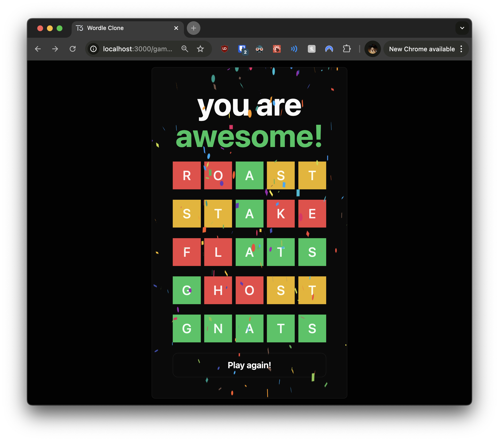

# 05: Word Validation

Welcome to the fifth section of our tutorial! In this part, you'll implement word validation in your Wordle clone. This will ensure that users can only submit valid guesses, enhancing the game's integrity and user experience. Additionally, you'll add error notifications to inform users when their guesses are invalid, similar to form validation feedback in Angular applications.

## Exercise Objectives

- **Implement** a function to validate if a word is acceptable.
- **Create** a custom hook for guess creation with validation.
- **Integrate** toast notifications for error handling.
- **Update** components to use the new validation logic.
- **Enhance** the UI to display guess results with color coding.

---

## Prerequisites

Before you begin, ensure you've completed the previous section or are up to date with the `checkpoint-04-keyboard` branch.

**To get up to speed:**

1. **Switch to the branch:**

   ```bash
   git checkout checkpoint-04-keyboard
   ```

2. **Install dependencies:**

   ```bash
   yarn install
   ```

3. **Start the development server:**

   ```bash
   yarn dev
   ```

Once you've completed these steps, you're ready to implement word validation.

---

## Tasks and Hints

### 1. Add Toast Notifications

**Task:** Update your application's layout to include a toast notification system. This will allow you to display error messages to users when their guesses are invalid.

**Why:** Providing immediate feedback enhances user experience and helps users understand why their input was rejected, similar to form validation messages in Angular.

**Instructions:**

- **Update** `src/app/layout.tsx` to include the `Toaster` component.

**Example:**

```typescript
// src/app/layout.tsx

import "~/styles/globals.css";

import { GeistSans } from "geist/font/sans";
import { type Metadata } from "next";

// Import the Toaster component for notifications
import { Toaster } from "~/components/ui/sonner";

export const metadata: Metadata = {
  title: "Wordle Clone",
  description: "Our awesome wordle clone",
};

export default function RootLayout({
  children,
}: Readonly<{ children: React.ReactNode }>) {
  return (
    <html lang="en" className={`${GeistSans.variable} dark`}>
      <body className="h-screen">{children}</body>
      {/* Add the Toaster component to display toast notifications */}
      <Toaster closeButton={true} expand={true} visibleToasts={4} />
    </html>
  );
}
```

**Comments:**

- **Imports:**
  - Importing `Toaster` from `"~/components/ui/sonner"`.
- **Toaster Component:**
  - Placed outside the `<body>` but inside the `<html>` to ensure it's globally available.
  - Configured with `closeButton`, `expand`, and `visibleToasts` props to control its behavior.

---

### 2. Implement Word Validation Function

**Task:** Create a function that checks if a given word is valid according to your word list.

**Why:** This function will be used to validate user guesses before they're submitted, preventing invalid words from being processed.

**Instructions:**

- **Update** `src/lib/utils.ts` to include the `isValidWord` function.

**Example:**

```typescript
// src/lib/utils.ts

import { type ClassValue, clsx } from "clsx";
import { twMerge } from "tailwind-merge";

// Import your list of valid words
import { words } from "./words";

export function cn(...inputs: ClassValue[]) {
  return twMerge(clsx(inputs));
}

export function getRandomWord() {
  const randomIndex = Math.floor(Math.random() * words.length);
  const word = words[randomIndex];
  if (!word) {
    throw new Error("Error retrieving random word");
  }
  return word;
}

// Function to check if a word is valid
export function isValidWord(word: string) {
  return words.includes(word.toLowerCase());
}
```

**Comments:**

- **isValidWord Function:**
  - Accepts a `word` string.
  - Converts the word to lowercase and checks if it's included in the `words` array.
  - Returns a boolean indicating whether the word is valid.

---

### 3. Create a Custom Hook for Guess Creation

**Task:** Develop a custom hook `useCreateGuess` that handles guess creation, including validation and error handling.

**Why:** Encapsulating this logic in a hook promotes reusability and clean code, similar to services in Angular.

**Instructions:**

- **Create** a new file `src/lib/hooks/use-create-guess.ts`.
- **Implement** validation logic using `zod` schema.
- **Use** toast notifications to display validation errors.

**Example:**

```typescript
// src/lib/hooks/use-create-guess.ts

import { REGEXP_ONLY_CHARS } from "input-otp";
import { toast } from "sonner";
import { z } from "zod";

import { api } from "~/server/api";

import { isValidWord } from "../utils";
import { useGuess } from "./use-guess";

// Define the validation schema using zod
const CreateGuessSchema = z.object({
  guess: z
    .string()
    .length(5, "Guess must be 5 characters long")
    .refine((value) => new RegExp(REGEXP_ONLY_CHARS).test(value), {
      message: "Guess must contain only letters",
    })
    .refine((value) => isValidWord(value), {
      message: "Guess must be a valid word",
    }),
  gameId: z.union([z.string(), z.number()]).transform((value) => Number(value)),
});

// Custom hook for creating a guess with validation
export const useCreateGuess = () => {
  const { setGuess } = useGuess();

  return async (guess: string, gameId: number) => {
    // Validate the input data against the schema
    const result = CreateGuessSchema.safeParse({ guess, gameId });
    if (!result.success) {
      // If validation fails, display error messages using toast notifications
      result.error.errors.forEach((error) => {
        toast.error(error.message);
      });
      return;
    }
    // If validation passes, create the guess using the API
    await api.guesses.create(guess, gameId);
    // Clear the current guess after submission
    setGuess("");
  };
};
```

**Comments:**

- **Imports:**

  - `zod` for schema validation.
  - `toast` from `sonner` for displaying notifications.
  - `isValidWord` function to check word validity.
  - `useGuess` hook to access and update the guess state.

- **CreateGuessSchema:**

  - Validates that `guess` is a 5-letter string containing only letters and is a valid word.
  - Transforms `gameId` to a number.

- **useCreateGuess Hook:**
  - Returns an asynchronous function that takes `guess` and `gameId`.
  - Uses `safeParse` to validate the input; if invalid, displays errors.
  - Calls `api.guesses.create` to submit the guess.
  - Resets the guess state using `setGuess("")`.

---

### 4. Update `GuessInput` Component

**Task:** Modify the `GuessInput` component to use the `useCreateGuess` hook for submitting guesses.

**Why:** This ensures that guesses entered via the input field are validated and handled consistently.

**Instructions:**

- **Update** `src/components/guess-input.tsx`.
- **Replace** direct API calls with the `createGuess` function from the hook.

**Example:**

```typescript
// src/components/guess-input.tsx

"use client";

import { REGEXP_ONLY_CHARS } from "input-otp";

import { useCreateGuess } from "~/lib/hooks/use-create-guess";
import { useGuess } from "~/lib/hooks/use-guess";

import { InputOTP, InputOTPGroup, InputOTPSlot } from "./ui/input-otp";

type GuessInputProps = {
  gameId: number;
};

export const GuessInput = ({ gameId }: GuessInputProps) => {
  const { guess, setGuess } = useGuess();

  // Use the custom hook for creating guesses
  const createGuess = useCreateGuess();

  return (
    <InputOTP
      maxLength={5}
      pattern={REGEXP_ONLY_CHARS}
      value={guess}
      onChange={(value) => setGuess(value)}
      onKeyDown={async (e) => {
        if (e.key === "Enter") {
          // Use the createGuess function to handle submission
          await createGuess(guess, gameId);
        }
      }}
    >
      <InputOTPGroup>
        {[...Array(5)].map((_, index) => (
          <InputOTPSlot
            key={index}
            index={index}
            className="h-12 w-12 text-2xl uppercase"
          />
        ))}
      </InputOTPGroup>
    </InputOTP>
  );
};
```

**Comments:**

- **Imports:**
  - `useCreateGuess` hook replaces direct API calls.
- **Event Handling:**
  - On Enter key press, calls `createGuess(guess, gameId)` instead of directly interacting with the API.
- **Benefits:**
  - Centralizes validation and error handling logic.
  - Ensures consistency across different input methods.

---

### 5. Update `GuessKeyboard` Component

**Task:** Modify the `GuessKeyboard` component to use the `useCreateGuess` hook for submitting guesses via the on-screen keyboard.

**Why:** This maintains consistency in validation and error handling between the keyboard and input field.

**Instructions:**

- **Update** `src/components/guess-keyboard.tsx`.
- **Use** the `createGuess` function when the Enter key is pressed.

**Example:**

```typescript
// src/components/guess-keyboard.tsx

"use client";

import "react-simple-keyboard/build/css/index.css";

import Keyboard from "react-simple-keyboard";

import { useCreateGuess } from "~/lib/hooks/use-create-guess";
import { useGuess } from "~/lib/hooks/use-guess";

type GuessKeyboardProps = {
  gameId: number;
};

export const GuessKeyboard = ({ gameId }: GuessKeyboardProps) => {
  const { guess, setGuess } = useGuess();

  // Use the custom hook for creating guesses
  const createGuess = useCreateGuess();

  return (
    <Keyboard
      theme="hg-theme-default !bg-secondary/75"
      buttonTheme={[
        {
          class:
            "!bg-background !text-foreground !border-none !shadow-none hover:!bg-secondary/50 active:!bg-white/25",
          buttons:
            "Q W E R T Y U I O P A S D F G H J K L Z X C V B N M {delete} {enter}",
        },
      ]}
      layout={{
        default: [
          "Q W E R T Y U I O P {delete}",
          "A S D F G H J K L {enter}",
          "Z X C V B N M",
        ],
      }}
      onKeyPress={async (input) => {
        if (input === "{delete}") {
          setGuess(guess.slice(0, -1));
          return;
        }

        if (input === "{enter}") {
          // Use the createGuess function to handle submission
          await createGuess(guess, gameId);
          return;
        }

        if (guess.length === 5) {
          // Prevent adding more than 5 characters
          return;
        }

        // Append the input character to the guess
        setGuess(guess + input);
      }}
    />
  );
};
```

**Comments:**

- **Imports:**
  - `useCreateGuess` hook is now used in this component.
- **Event Handling:**
  - When the `{enter}` key is pressed, calls `createGuess(guess, gameId)`.
- **Consistency:**
  - Both physical and on-screen keyboards now use the same validation logic.

---

### 6. Update `GuessItem` Component

**Task:** Enhance the `GuessItem` component to display the result of each guess with appropriate color coding.

**Why:** Visual feedback helps users understand which letters are correct, similar to the original Wordle game.

**Instructions:**

- **Update** `src/components/guess-item.tsx`.
- **Map** the result characters to corresponding colors.

**Example:**

```typescript
// src/components/guess-item.tsx

"use client";

import { cn } from "~/lib/utils";
import { type api } from "~/server/api";

import { InputOTP, InputOTPGroup, InputOTPSlot } from "./ui/input-otp";

type GuessItemProps = {
  guess: Awaited<ReturnType<typeof api.guesses.findByGameId>>[number];
};

// Helper component to render each slot with the correct color
function GuessItemSlot({ index, result }: { index: number; result: string }) {
  return (
    <InputOTPSlot
      index={index}
      className={cn("h-12 w-12 text-2xl uppercase", {
        "bg-red-500 text-red-50": result === "X", // Incorrect letter
        "bg-green-500 text-green-50": result === "C", // Correct letter in correct position
        "bg-yellow-500 text-yellow-50": result === "~", // Correct letter in wrong position
      })}
    />
  );
}

export const GuessItem = ({ guess }: GuessItemProps) => {
  return (
    <InputOTP readOnly maxLength={5} value={guess.guess}>
      <InputOTPGroup>
        {[0, 1, 2, 3, 4].map((index) => (
          <GuessItemSlot
            key={index}
            index={index}
            result={guess.result[index] ?? ""}
          />
        ))}
      </InputOTPGroup>
    </InputOTP>
  );
};
```

**Comments:**

- **Imports:**
  - `cn` utility function for conditional class names.
- **GuessItemSlot Component:**
  - Determines the color of each slot based on the `result` character.
  - Uses `cn` to apply the appropriate background and text colors.
- **Mapping Results:**

  - `"C"`: Green for correct letter and position.
  - `"~"`: Yellow for correct letter but wrong position.
  - `"X"`: Red for incorrect letter.

- **Rendering:**
  - Iterates over each character in the guess and displays it with the correct styling.

---

## Checking Your Progress

Now that you've implemented word validation and enhanced user feedback, it's time to test your application.

**Instructions:**

1. **Start the Development Server:**

   ```bash
   yarn dev
   ```

2. **Navigate to a Game:**

   - Open your browser and go to `http://localhost:3000`.
   - Start a new game or continue an existing one.

3. **Test Input Constraints:**

   

   - **Enter Invalid Characters:**
     - Try entering numbers or special characters.
     - The input should reject these characters.
   - **Exceed Character Limit:**
     - Attempt to enter more than 5 letters.
     - The input should stop accepting letters after the fifth character.

4. **Test Word Validation:**

   - **Invalid Word:**
     - Enter a 5-letter word that's not in the word list (e.g., "ABCDE").
     - Upon submission, a toast notification should display an error message like "Guess must be a valid word".
   - **Valid Word:**
     - Enter a valid 5-letter word (e.g., "APPLE").
     - The guess should be accepted and appear on the game board without errors.

5. **Verify Toast Notifications:**

   - Ensure that error messages appear as toast notifications at the bottom of the screen.
   - Test various invalid inputs to see different error messages.

6. **Check Guess Visualization:**

   - After submitting a valid guess, verify that the letters are color-coded correctly:
     - **Green:** Correct letter in the correct position.
     - **Yellow:** Correct letter in the wrong position.
     - **Red/Default:** Incorrect letter.

If everything works as expected, congratulations! You've successfully enhanced your Wordle clone with word validation and improved user feedback.

---

## Next Steps

In the next section, we'll focus on implementing game-over conditions and adding a feature to start a new game after completion. This will involve:

- **Game Logic Enhancements:**

  - Determining when the game is won or lost.
  - Handling scenarios where the player runs out of guesses.

- **User Interface Updates:**
  - Displaying game-over messages.
  - Providing options to start a new game.

---
