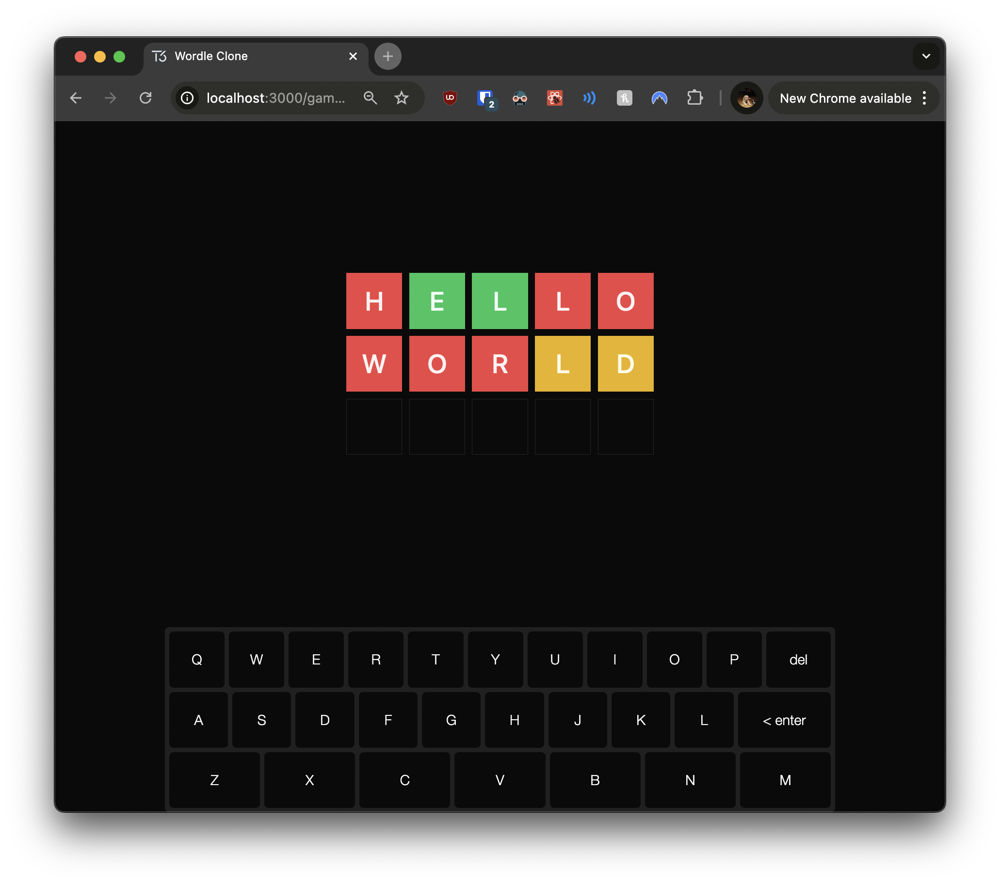
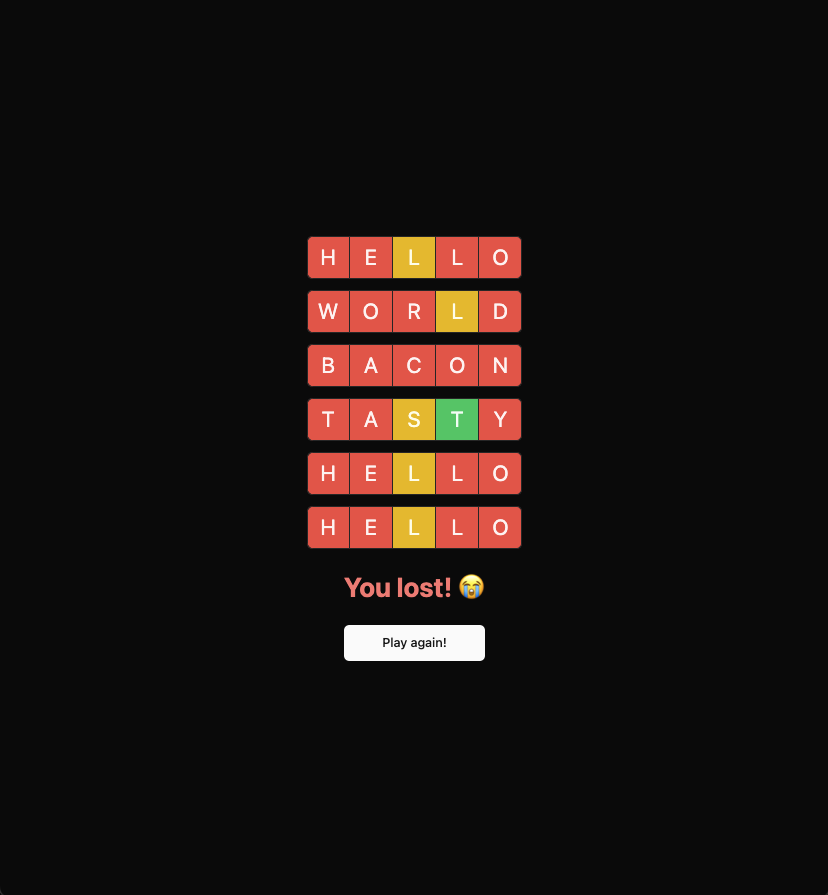

# 06: Implementing Game Over Logic

Welcome to the sixth section of our tutorial! In this section, you'll implement the **game over logic** in your Wordle clone. This includes handling game completion, displaying results, and allowing users to start a new game. By the end of this section, your game will offer a complete experience from start to finish.

## Prerequisites

Before you begin, ensure you've completed the previous section or are up to date with the `checkpoint-05-word-validation` branch.

**To get up to speed:**

1. **Switch to the branch:**

   ```bash
   git checkout checkpoint-05-word-validation
   ```

2. **Install dependencies:**

   ```bash
   yarn install
   ```

3. **Start the development server:**

   ```bash
   yarn dev
   ```

Once you've completed these steps, you're ready to implement the game over logic.

---

## Implementing Game Over Logic

In this section, you'll enhance your Wordle clone by implementing logic to handle the end of the game. This includes determining when the game is won or lost, displaying appropriate messages, and providing a way for users to start a new game. This is similar to handling game state transitions and user feedback in Angular applications.

### Exercise 1: Updating the Game Page

Your first task is to modify the game page to fetch both the game status and the user's guesses. This will allow you to determine whether the game is in progress, won, or lost, and render components accordingly.

**Instructions:**

1. Open `src/app/game/[gameId]/page.tsx`.
2. Fetch both the `game` and `guesses` data from the server using the `api`.
3. Pass the `game.status` to the `GameBoard` component.
4. Conditionally render the `GuessKeyboard` component only if the game is in progress.

**Hints:**

- Since this is a server component, you can directly fetch data using the `api` without hooks.
- Use conditional rendering to display the keyboard only when `game.status` is `"in_progress"`.
- This approach is similar to how you might fetch data and conditionally render components in Angular templates.

Here's a starting point for your updated game page:

```typescript
// src/app/game/[gameId]/page.tsx

import { GameBoard } from "~/components/game-board";
import { GuessKeyboard } from "~/components/guess-keyboard";
import { GuessProvider } from "~/lib/store/guess-provider";
import { api } from "~/server/api";

// This is a server component; it does not have "use client" at the top
// We can fetch data directly from the server inside this component
export default async function GamePage({
  params: { gameId },
}: {
  params: { gameId: number };
}) {
  // TODO: Fetch both game and guesses data from the server using the api

  return (
    <GuessProvider>
      <div className="flex h-full flex-col items-center gap-6">
        <div className="flex flex-1 items-center justify-center">
          {/* TODO: Pass game status to GameBoard */}
          <GameBoard gameId={gameId} guesses={guesses} />
        </div>
        {/* TODO: Conditionally render the GuessKeyboard only if the game is in progress */}
        <div className="flex w-full max-w-3xl items-center">
          <GuessKeyboard gameId={gameId} />
        </div>
      </div>
    </GuessProvider>
  );
}
```

When you're ready, check your implementation against the provided solution.

---

<details>
<summary>👉 Click here to see the solution 👈</summary>

```typescript
// src/app/game/[gameId]/page.tsx

import { GameBoard } from "~/components/game-board";
import { GuessKeyboard } from "~/components/guess-keyboard";
import { GuessProvider } from "~/lib/store/guess-provider";
import { api } from "~/server/api";

// This is a server component; it does not have "use client" at the top
// We can fetch data directly from the server inside this component
export default async function GamePage({
  params: { gameId },
}: {
  params: { gameId: number };
}) {
  // Fetch both game and guesses data from the server using the api
  const game = await api.games.getById(gameId);
  const guesses = await api.guesses.findByGameId(gameId);

  return (
    <GuessProvider>
      <div className="flex h-full flex-col items-center gap-6">
        <div className="flex flex-1 items-center justify-center">
          {/* Pass game status to GameBoard */}
          <GameBoard gameId={gameId} status={game.status} guesses={guesses} />
        </div>
        {/* Conditionally render the GuessKeyboard only if the game is in progress */}
        {game.status === "in_progress" && (
          <div className="flex w-full max-w-3xl items-center">
            <GuessKeyboard gameId={gameId} />
          </div>
        )}
      </div>
    </GuessProvider>
  );
}
```

</details>

---

### Exercise 2: Updating the `GameBoard` Component

Next, you'll modify the `GameBoard` component to handle different game statuses and incorporate a new `GameResults` component. This component will display messages when the game is won or lost.

**Instructions:**

1. Open `src/components/game-board.tsx`.
2. Update the component to accept a `status` prop.
3. Conditionally render the `GuessInput` component only if the game is in progress.
4. Add the `GameResults` component to display the game outcome.

**Hints:**

- The `status` prop allows the component to render different content based on the game's state.
- Use conditional rendering to show or hide components based on the `status`.
- This approach is similar to handling conditional content in Angular templates using `*ngIf`.

Here's a starting point for your updated `GameBoard` component:

```typescript
// src/components/game-board.tsx

import { type api } from "~/server/api";
import { type games } from "~/server/db/schema";

import { GameResults } from "./game-results";
import { GuessInput } from "./guess-input";
import { GuessList } from "./guess-list";

type GameBoardProps = {
  gameId: number;
  // TODO: Accept a status prop of type games.status
  guesses: Awaited<ReturnType<typeof api.guesses.findByGameId>>;
};

export const GameBoard = ({ gameId, guesses }: GameBoardProps) => {
  return (
    <div className="flex grow flex-col items-center gap-6">
      {/* Always show the list of guesses */}
      <GuessList guesses={guesses} />
      {/* TODO: Conditionally render GuessInput if the game is in progress */}
      {/* <GuessInput gameId={gameId} /> */}
      {/* TODO: Add GameResults component to display game outcome */}
    </div>
  );
};
```

When you're ready, check your implementation against the provided solution.

---

<details>
<summary>👉 Click here to see the solution 👈</summary>

```typescript
// src/components/game-board.tsx

import { type api } from "~/server/api";
import { type games } from "~/server/db/schema";

import { GameResults } from "./game-results";
import { GuessInput } from "./guess-input";
import { GuessList } from "./guess-list";

type GameBoardProps = {
  gameId: number;
  status: (typeof games.status.enumValues)[number];
  guesses: Awaited<ReturnType<typeof api.guesses.findByGameId>>;
};

export const GameBoard = ({ gameId, status, guesses }: GameBoardProps) => {
  return (
    <div className="flex grow flex-col items-center gap-6">
      {/* Always show the list of guesses */}
      <GuessList guesses={guesses} />
      {/* Only show GuessInput if the game is still in progress */}
      {status === "in_progress" && <GuessInput gameId={gameId} />}
      {/* Show game results when the game is over */}
      <GameResults status={status} />
    </div>
  );
};
```

</details>

---

### Exercise 3: Creating the `GameResults` Component

Now, you'll create a new `GameResults` component that displays a message based on the game's outcome and includes a "Play Again" button to start a new game.

**Instructions:**

1. Create a new file at `src/components/game-results.tsx`.
2. Implement the `GameResults` component that accepts a `status` prop.
3. Use a `switch` statement or conditional rendering to display different messages based on the `status`.
4. Create a `PlayAgainButton` component that uses a custom hook `useCreateGame` (to be created in the next exercise).

**Hints:**

- The `status` can be `"in_progress"`, `"won"`, or `"lost"`.
- Use React's `use client` directive at the top of the file since this component will handle user interactions.
- This is similar to creating a reusable component in Angular that displays content based on input properties.

Here's a starting point for your `GameResults` component:

```typescript
// src/components/game-results.tsx

"use client";

import { useCreateGame } from "~/lib/hooks/use-create-game";
import { type games } from "~/server/db/schema";

import { Button } from "./ui/button";

type GameResultsProps = {
  // TODO: Accept a status prop of type games.status
};

// Separate component for the "Play Again" button
const PlayAgainButton = () => {
  // TODO: Use the useCreateGame hook
  // const createGame = useCreateGame();

  return (
    <Button size="lg" onClick={/* TODO: Call createGame */}>
      Play again!
    </Button>
  );
};

export const GameResults = (/* TODO: Destructure status from props */) => {
  // TODO: Use a switch statement or conditional rendering based on status
  // Render different messages for "won" and "lost" statuses
  return null;
};
```

When you're ready, check your implementation against the provided solution.

---

<details>
<summary>👉 Click here to see the solution 👈</summary>

```typescript
// src/components/game-results.tsx

"use client";

import { useCreateGame } from "~/lib/hooks/use-create-game";
import { type games } from "~/server/db/schema";

import { Button } from "./ui/button";

type GameResultsProps = {
  status: (typeof games.status.enumValues)[number];
};

// Separate component for the "Play Again" button
const PlayAgainButton = () => {
  const createGame = useCreateGame();

  return (
    <Button size="lg" onClick={createGame}>
      Play again!
    </Button>
  );
};

export const GameResults = ({ status }: GameResultsProps) => {
  // Use a switch statement to handle different game statuses
  switch (status) {
    case "in_progress":
      return null; // Don't show anything if the game is still in progress
    case "won":
      return (
        <div className="flex flex-col items-center gap-6">
          <div className="text-3xl font-bold text-green-400">
            Bam! You won! 🎉
          </div>
          <PlayAgainButton />
        </div>
      );
    case "lost":
      return (
        <div className="flex flex-col items-center gap-6">
          <div className="text-3xl font-bold text-red-400">You lost! 😭</div>
          <PlayAgainButton />
        </div>
      );
    default:
      return null;
  }
};
```

</details>

---

### Exercise 4: Creating a Custom Hook for Game Creation

To encapsulate the logic for creating a new game and navigating to it, you'll develop a `useCreateGame` hook. This makes it easy to reuse this functionality in multiple components.

**Instructions:**

1. Create a new file at `src/lib/hooks/use-create-game.ts`.
2. Implement the `useCreateGame` hook that creates a new game using the `api`.
3. Use Next.js's `useRouter` for navigation to redirect the user to the new game page after creation.

**Hints:**

- The hook should return a function that can be called to create a new game.
- This is similar to creating a service in Angular that handles navigation and data operations.
- Remember to handle asynchronous operations with `async` and `await`.

Here's a starting point for your `useCreateGame` hook:

```typescript
// src/lib/hooks/use-create-game.ts

import { useRouter } from "next/navigation";

import { api } from "~/server/api";

export const useCreateGame = (withRedirect = true) => {
  const router = useRouter();

  return async () => {
    // TODO: Create a new game using the API
    // const game = await api.games.create();

    if (withRedirect) {
      // TODO: Redirect to the new game page using router.push
    }

    // return game;
  };
};
```

When you're ready, check your implementation against the provided solution.

---

<details>
<summary>👉 Click here to see the solution 👈</summary>

```typescript
// src/lib/hooks/use-create-game.ts

import { useRouter } from "next/navigation";

import { api } from "~/server/api";

export const useCreateGame = (withRedirect = true) => {
  const router = useRouter();

  return async () => {
    // Create a new game using the API
    const game = await api.games.create();

    if (withRedirect) {
      // Redirect to the new game page using router.push
      router.push(`/game/${game.id}`);
    }

    return game;
  };
};
```

</details>

---

### Exercise 5: Updating the Home Page

You'll modify the home page to use the `useCreateGame` hook, simplifying the code and improving reusability.

**Instructions:**

1. Open `src/app/page.tsx`.
2. Import the `useCreateGame` hook.
3. Replace any existing game creation logic with a call to `useCreateGame`.

**Hints:**

- This change ensures that the game creation and navigation logic is centralized.
- This is similar to injecting a service into an Angular component to handle operations.

Here's a starting point for your updated home page:

```typescript
// src/app/page.tsx

"use client";

import { Button } from "~/components/ui/button";
// TODO: Import the useCreateGame hook
// import { useCreateGame } from "~/lib/hooks/use-create-game";

export default function HomePage() {
  // TODO: Use the useCreateGame hook
  // const createGame = useCreateGame();

  return (
    <main className="flex h-full items-center justify-center">
      <Button
        onClick={/* TODO: Call createGame when the button is clicked */}
      >
        New game
      </Button>
    </main>
  );
}
```

When you're ready, check your implementation against the provided solution.

---

<details>
<summary>👉 Click here to see the solution 👈</summary>

```typescript
// src/app/page.tsx

"use client";

import { Button } from "~/components/ui/button";
import { useCreateGame } from "~/lib/hooks/use-create-game";

export default function HomePage() {
  // Use the useCreateGame hook
  const createGame = useCreateGame();

  return (
    <main className="flex h-full items-center justify-center">
      <Button onClick={createGame}>New game</Button>
    </main>
  );
}
```

</details>

---

### Exercise 6: Updating the Guess Service

To implement the game over logic, you'll enhance the guess service to determine when the game is won or lost and update the game status accordingly.

**Instructions:**

1. Open `src/server/services/guess.service.ts`.
2. Modify the `create` function to check for game over conditions after a guess is made.
3. Update the game status to `"won"` if the user has guessed the word correctly.
4. Update the game status to `"lost"` if the user has used all six guesses without guessing correctly.
5. Use `revalidatePath` to refresh the game page after updating the game status.

**Hints:**

- Use helper functions to count the number of guesses made.
- Compare the result of the guess to determine if the word was guessed correctly.
- This is similar to updating the application's state and triggering UI updates in an Angular service.

Here's a starting point for your updated guess service:

```typescript
// src/server/services/guess.service.ts

import { asc, count, eq } from "drizzle-orm";
import { revalidatePath } from "next/cache";

import { db } from "../db";
import { games, guesses } from "../db/schema";
import { gameService } from "./game.service";

// ... (previous code remains the same)

const create = async (guess: string, gameId: number) => {
  const result = await checkGuess(guess, gameId);

  const [createdGuess] = await db
    .insert(guesses)
    .values({
      gameId,
      guess: guess.toUpperCase(),
      result,
    })
    .returning();

  if (!createdGuess) {
    throw new Error("Failed to create guess");
  }

  // TODO: Count the number of guesses made for this game
  // const count = await countByGameId(gameId);

  // TODO: Check for game over conditions
  // If the guess result is "CCCCC", update game status to "won"
  // If the count is 6 and the word hasn't been guessed, update game status to "lost"

  // TODO: Revalidate the game page to reflect the new state
  // revalidatePath(`/game/${gameId}`);

  return createdGuess;
};

// ... (rest of the code remains the same)

// Helper function to count guesses by game ID
const countByGameId = async (gameId: number) => {
  // TODO: Implement the function to count guesses
};

export const guessService = {
  create,
  findByGameId,
};
```

When you're ready, check your implementation against the provided solution.

---

<details>
<summary>👉 Click here to see the solution 👈</summary>

```typescript
// src/server/services/guess.service.ts

import { asc, count, eq } from "drizzle-orm";
import { revalidatePath } from "next/cache";

import { db } from "../db";
import { games, guesses } from "../db/schema";
import { gameService } from "./game.service";

// ... (previous code remains the same)

const create = async (guess: string, gameId: number) => {
  const result = await checkGuess(guess, gameId);

  const [createdGuess] = await db
    .insert(guesses)
    .values({
      gameId,
      guess: guess.toUpperCase(),
      result,
    })
    .returning();

  if (!createdGuess) {
    throw new Error("Failed to create guess");
  }

  // Count the number of guesses made for this game
  const count = await countByGameId(gameId);

  // Check for game over conditions
  if (createdGuess.result === "CCCCC") {
    // If all letters are correct, the game is won
    await gameService.update(gameId, "won");
  } else if (count === 6) {
    // If it's the 6th guess and the word hasn't been guessed, the game is lost
    await gameService.update(gameId, "lost");
  }

  // Revalidate the game page to reflect the new state
  revalidatePath(`/game/${gameId}`);

  return createdGuess;
};

// ... (rest of the code remains the same)

// Helper function to count guesses by game ID
const countByGameId = async (gameId: number) => {
  // Count the number of guesses for a specific game
  const [gameCount] = await db
    .select({ count: count() })
    .from(guesses)
    .where(eq(guesses.gameId, gameId));

  if (!gameCount) {
    throw new Error("Error counting guesses");
  }

  return gameCount.count;
};

export const guessService = {
  create,
  findByGameId,
};
```

</details>

---

## Checking Your Progress

Now that you've implemented the game over logic and new game creation, it's time to test your application.

**Instructions:**

1. **Start the Development Server:**

   ```bash
   yarn dev
   ```

2. **Start a New Game:**

   - Navigate to `http://localhost:3000`.
   - Click the "New game" button on the home page.
   - You should be redirected to a new game page (e.g., `http://localhost:3000/game/1`).

3. **Play Through a Game:**

   - **Win Scenario:**

     

     - Guess the correct word within six attempts.
     - Upon winning:
       - The keyboard should disappear.
       - A victory message ("Bam! You won! 🎉") should be displayed.
       - A "Play again!" button should appear.

   - **Lose Scenario:**

     

     - Make six incorrect guesses.
     - Upon losing:
       - The keyboard should disappear.
       - A losing message ("You lost! 😭") should be displayed.
       - A "Play again!" button should appear.

4. **Check Game Status Persistence:**

   - Refresh the page after winning or losing.
   - The game over state should persist, showing the same message and not resetting the game.

5. **Start a New Game from the Game Over State:**

   - Click the "Play again!" button.
   - You should be redirected to a new game page with a fresh board and keyboard.

If everything works as expected, congratulations! You've successfully implemented the game over logic in your Wordle clone.

---

## Next Steps

In the next section, we'll focus on adding final touches to our game, such as:

- **UI Enhancements:**

  - Adding animations for guess submissions.
  - Improving the overall styling and responsiveness.

By continuing to refine your application, you'll enhance the user experience and solidify your understanding of state management and component interaction in React, similar to advanced techniques in Angular applications.

---

## Helpful Resources

To further enhance your understanding, you might find the following resources helpful:

1. **Next.js Documentation:**

   - [Data Fetching in Next.js](https://nextjs.org/docs/basic-features/data-fetching)
     - Learn more about how data fetching works in Next.js, especially in server components.

2. **React Conditional Rendering:**

   - [React Docs: Conditional Rendering](https://reactjs.org/docs/conditional-rendering.html)
     - Understand how to render components based on certain conditions.

3. **State Management in React:**

   - [React Context API](https://reactjs.org/docs/context.html)
     - Explore how to manage and share state across components without prop drilling.

---
