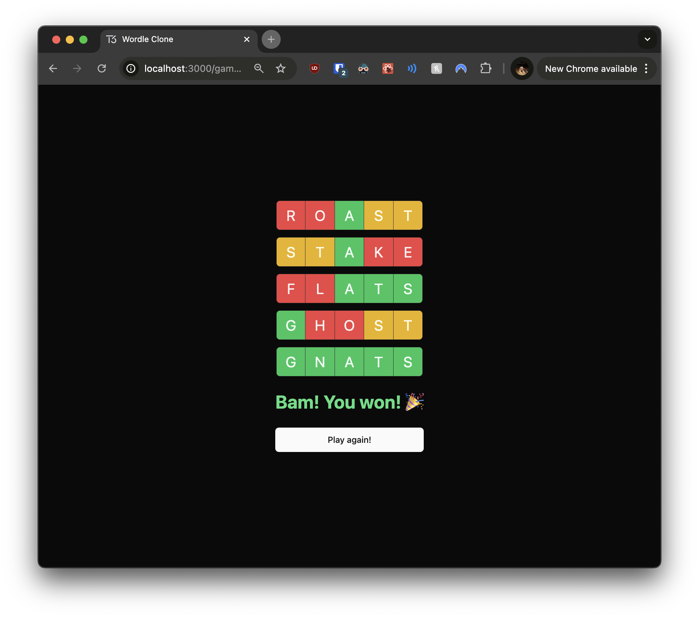
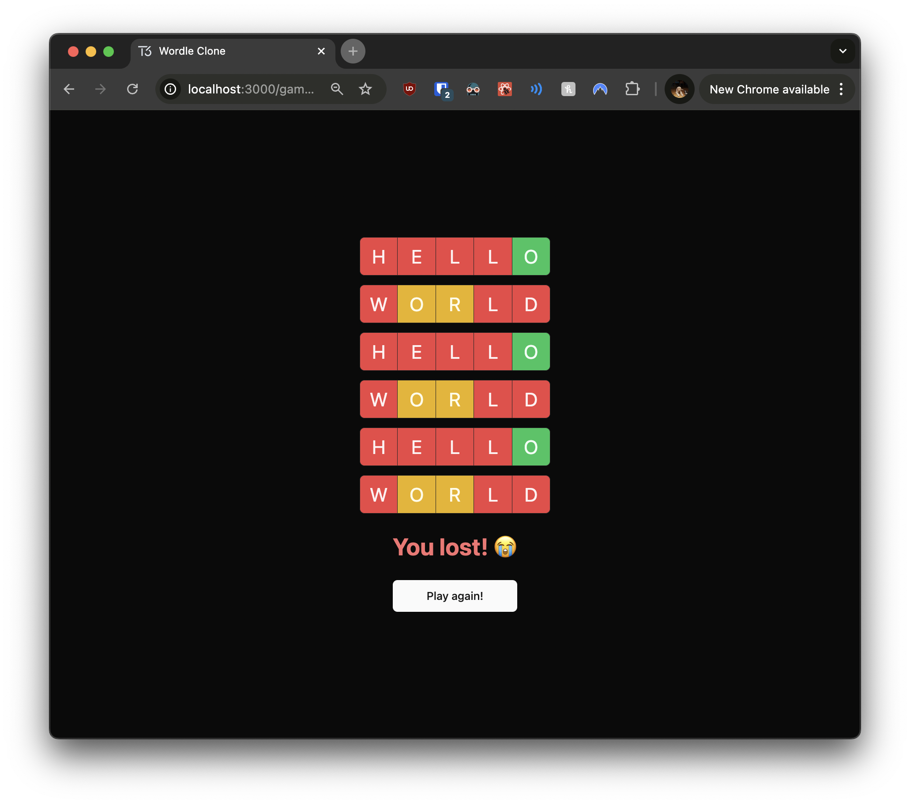

# 06: Implementing Game Over Logic

Welcome to the sixth section of the tutorial! In this section, you'll implement the **game over logic** in your Wordle clone. This includes handling game completion, displaying results, and allowing users to start a new game. By the end of this section, your game will offer a complete experience from start to finish.

## Prerequisites

Before you begin, ensure you've completed the previous section or are up to date with the `checkpoint-05-word-validation` branch.

**To get up to speed:**

1. **Switch to the branch:**

   ```bash
   git checkout checkpoint-05-word-validation
   ```

2. **Install dependencies:**

   ```bash
   yarn install
   ```

3. **Start the development server:**

   ```bash
   yarn dev
   ```

Once you've completed these steps, you're ready to implement the game over logic.

---

## Implementing Game Over Logic

In this section, you'll enhance your Wordle clone by implementing logic to handle the end of the game. This includes determining when the game is won or lost, displaying appropriate messages, and providing a way for users to start a new game. This is similar to handling game state transitions and user feedback in Angular applications.

### Exercise 1: Updating the Game Page

Your task is to modify the existing `GamePage` component to fetch the game status and guesses, and pass this information to the `GameBoard` component. You'll also add conditional rendering for the `GuessKeyboard` component.

**Instructions:**

1. **Update the Game Page File:**

   - Open the file at `src/app/game/[gameId]/page.tsx`.

2. **Fetch Game and Guesses Data:**

   - Use the `api` object to fetch both the game and guesses data.

3. **Modify the `GamePage` Component:**

   - Pass the game status and guesses to the `GameBoard` component.
   - Add conditional rendering for the `GuessKeyboard` component.

**Hints:**

- Use `await api.games.getById(gameId)` to fetch the game data.
- Use `await api.guesses.findByGameId(gameId)` to fetch the guesses data.
- The `GuessKeyboard` should only be rendered if the game status is "in_progress".
- Remember that this is a server component, so you can use `async/await` directly in the component function.

Here's a starting point for your updated `GamePage` component:

```typescript
// src/app/game/[gameId]/page.tsx

import { GameBoard } from "~/components/game-board";
import { GuessKeyboard } from "~/components/guess-keyboard";
import { GuessProvider } from "~/lib/store/guess-provider";
import { api } from "~/server/api";

export default async function GamePage({
  params: { gameId },
}: {
  params: { gameId: number };
}) {
  // TODO: Fetch game and guesses data

  return (
    <GuessProvider>
      <div className="flex h-full flex-col items-center gap-6">
        <div className="flex flex-1 items-center justify-center">
          {/* TODO: Pass game status and guesses to GameBoard */}
          <GameBoard gameId={gameId} />
        </div>
        {/* TODO: Conditionally render GuessKeyboard */}
      </div>
    </GuessProvider>
  );
}
```

**Try to implement this component before looking at the solution.**

<details>
<summary>👉 Click here to see the solution 👈</summary>

```typescript
// src/app/game/[gameId]/page.tsx

import { GameBoard } from "~/components/game-board";
import { GuessKeyboard } from "~/components/guess-keyboard";
import { GuessProvider } from "~/lib/store/guess-provider";
import { api } from "~/server/api";

export default async function GamePage({
  params: { gameId },
}: {
  params: { gameId: number };
}) {
  // Fetch both game and guesses data from the server using the api
  const game = await api.games.getById(gameId);
  const guesses = await api.guesses.findByGameId(gameId);

  return (
    <GuessProvider>
      <div className="flex h-full flex-col items-center gap-6">
        <div className="flex flex-1 items-center justify-center">
          {/* Pass game status to GameBoard */}
          <GameBoard gameId={gameId} status={game.status} guesses={guesses} />
        </div>
        {/* Conditionally render the GuessKeyboard only if the game is in progress */}
        {game.status === "in_progress" && (
          <div className="flex w-full max-w-3xl items-center">
            <GuessKeyboard gameId={gameId} />
          </div>
        )}
      </div>
    </GuessProvider>
  );
}
```

**Explanation:**

- **Data Fetching:**
  - Used `api.games.getById(gameId)` to fetch the current game's data, including its status.
  - Used `api.guesses.findByGameId(gameId)` to fetch all guesses associated with the game.
- **Passing Game Status:**
  - Passed the `game.status` prop to the `GameBoard` component to manage game state within the board.
- **Conditional Rendering:**
  - Rendered the `GuessKeyboard` component only if `game.status` is `"in_progress"`, ensuring the keyboard is hidden when the game is over.

</details>

### Exercise 2: Updating the `GameBoard` Component

Next, you'll modify the `GameBoard` component to handle different game statuses and incorporate a new `GameResults` component. This component will display messages when the game is won or lost.

**Instructions:**

1. **Update the GameBoard File:**

   - Open the file at `src/components/game-board.tsx`.

2. **Modify the `GameBoardProps` Type:**

   - Add a `status` property to the `GameBoardProps` type.

3. **Update the `GameBoard` Component:**

   - Add conditional rendering for the `GuessInput` component.
   - Add the `GameResults` component to display game outcome.

**Hints:**

- The `status` prop should be of type `(typeof games.status.enumValues)[number]`.
- Only render the `GuessInput` component if the game status is "in_progress".
- The `GameResults` component should always be rendered, but it will handle displaying content based on the game status internally.

Here's a starting point for your updated `GameBoard` component:

```typescript
// src/components/game-board.tsx

import { type api } from "~/server/api";
import { type games } from "~/server/db/schema";

import { GameResults } from "./game-results";
import { GuessInput } from "./guess-input";
import { GuessList } from "./guess-list";

type GameBoardProps = {
  gameId: number;
  // TODO: Add status prop
  guesses: Awaited<ReturnType<typeof api.guesses.findByGameId>>;
};

export const GameBoard = ({ gameId, guesses }: GameBoardProps) => {
  return (
    <div className="flex grow flex-col items-center gap-6">
      <GuessList guesses={guesses} />
      {/* TODO: Conditionally render GuessInput */}
      {/* TODO: Add GameResults component */}
    </div>
  );
};
```

**Try to implement this component before looking at the solution.**

<details>
<summary>👉 Click here to see the solution 👈</summary>

```typescript
// src/components/game-board.tsx

import { type api } from "~/server/api";
import { type games } from "~/server/db/schema";

import { GameResults } from "./game-results";
import { GuessInput } from "./guess-input";
import { GuessList } from "./guess-list";

type GameBoardProps = {
  gameId: number;
  status: (typeof games.status.enumValues)[number];
  guesses: Awaited<ReturnType<typeof api.guesses.findByGameId>>;
};

export const GameBoard = ({ gameId, status, guesses }: GameBoardProps) => {
  return (
    <div className="flex grow flex-col items-center gap-6">
      <GuessList guesses={guesses} />
      {status === "in_progress" && <GuessInput gameId={gameId} />}
      <GameResults status={status} />
    </div>
  );
};
```

**Explanation:**

- **Props Update:**
  - Updated the `GameBoardProps` type to include the `status` property.
- **Conditional Rendering:**
  - Displayed the `GuessInput` component only when the game status is `"in_progress"`.
- **Game Results:**
  - Added the `GameResults` component to show the outcome of the game when it's over.

</details>

### Exercise 3: Creating the `GameResults` Component

Now, you'll create a new `GameResults` component that displays a message based on the game's outcome and includes a "Play Again" button to start a new game.

**Instructions:**

1. **Create the GameResults File:**

   - Create a new file at `src/components/game-results.tsx`.

2. **Implement the `GameResults` Component:**

   - Create a component that accepts a `status` prop.
   - Display different messages based on the game status.
   - Include a "Play Again" button that creates a new game.

3. **Implement the `PlayAgainButton` Component:**

   - Create a separate component for the "Play Again" button.
   - Use the `useCreateGame` hook to handle creating a new game.

**Hints:**

- Use a `switch` statement to handle different game statuses.
- The `useCreateGame` hook should be imported from `~/lib/hooks/use-create-game`.
- Remember to mark this as a client component with `"use client";` at the top of the file.

Here's a starting point for your `GameResults` component:

```typescript
// src/components/game-results.tsx

"use client";

import { useCreateGame } from "~/lib/hooks/use-create-game";
import { type games } from "~/server/db/schema";

import { Button } from "./ui/button";

type GameResultsProps = {
  status: (typeof games.status.enumValues)[number];
};

// TODO: Implement PlayAgainButton component

export const GameResults = ({ status }: GameResultsProps) => {
  // TODO: Implement game results logic
};
```

**Try to implement this component before looking at the solution.**

<details>
<summary>👉 Click here to see the solution 👈</summary>

```typescript
// src/components/game-results.tsx

"use client";

import { useCreateGame } from "~/lib/hooks/use-create-game";
import { type games } from "~/server/db/schema";

import { Button } from "./ui/button";

type GameResultsProps = {
  status: (typeof games.status.enumValues)[number];
};

const PlayAgainButton = () => {
  const createGame = useCreateGame();

  return (
    <Button size="lg" onClick={createGame}>
      Play again!
    </Button>
  );
};

export const GameResults = ({ status }: GameResultsProps) => {
  switch (status) {
    case "in_progress":
      return null;
    case "won":
      return (
        <div className="flex flex-col items-center gap-6">
          <div className="text-3xl font-bold text-green-400">
            Bam! You won! 🎉
          </div>
          <PlayAgainButton />
        </div>
      );
    case "lost":
      return (
        <div className="flex flex-col items-center gap-6">
          <div className="text-3xl font-bold text-red-400">You lost! 😭</div>
          <PlayAgainButton />
        </div>
      );
    default:
      return null;
  }
};
```

**Explanation:**

- **Client-Side Component:**
  - Added `"use client";` at the top because the component handles client-side interactions.
- **`PlayAgainButton` Component:**
  - Used the `useCreateGame` hook to create a new game when the button is clicked.
- **Status-Based Rendering:**
  - Used a `switch` statement to display different messages based on the `status` prop.
  - Rendered a victory message for `"won"` status and a defeat message for `"lost"` status, each accompanied by the `PlayAgainButton`.

</details>

### Exercise 4: Creating a Custom Hook for Game Creation

To encapsulate the logic for creating a new game and navigating to it, you'll develop a `useCreateGame` hook. This makes it easy to reuse this functionality in multiple components.

**Instructions:**

1. **Create the useCreateGame File:**

   - Create a new file at `src/lib/hooks/use-create-game.ts`.

2. **Implement the `useCreateGame` Hook:**

   - Create a function that uses the `api` to create a new game.
   - Use the Next.js `useRouter` hook to handle navigation.
   - Add an option to control whether to redirect after game creation.

**Hints:**

- Import `useRouter` from `next/navigation`.
- Use `api.games.create()` to create a new game.
- Use `router.push()` to navigate to the new game page.

Here's a starting point for your `useCreateGame` hook:

```typescript
// src/lib/hooks/use-create-game.ts

import { useRouter } from "next/navigation";

import { api } from "~/server/api";

export const useCreateGame = (withRedirect = true) => {
  const router = useRouter();

  // TODO: Implement game creation logic
};
```

**Try to implement this hook before looking at the solution.**

<details>
<summary>👉 Click here to see the solution 👈</summary>

```typescript
// src/lib/hooks/use-create-game.ts

import { useRouter } from "next/navigation";

import { api } from "~/server/api";

export const useCreateGame = (withRedirect = true) => {
  const router = useRouter();

  return async () => {
    // Create a new game using the API
    const game = await api.games.create();

    if (withRedirect) {
      // Redirect to the new game page using router.push
      router.push(`/game/${game.id}`);
    }

    // Return the new game object if needed
    return game;
  };
};
```

**Explanation:**

- **Router for Navigation:**
  - Used `useRouter` from Next.js to handle client-side navigation.
- **Game Creation Logic:**
  - Created an asynchronous function that calls `api.games.create()` to create a new game.
- **Conditional Redirect:**
  - If `withRedirect` is `true`, used `router.push` to navigate to the new game's page.

</details>

Here’s the full content for **Exercise 5**, including the **Explanation** section in the solution:

---

### Exercise 5: Updating the Guess Service

In this exercise, you'll update the **guess service** to handle game state transitions when a player has either won or lost. This includes counting the number of guesses and updating the game's status based on the result.

**Instructions:**

1. **Update the Guess Service File:**

   - Open the file at `src/server/services/guess.service.ts`.

2. **Update the `create` Function:**

   - Modify the `create` function to handle the following scenarios:
     - The player has lost after six incorrect guesses.
     - The player has won by guessing the correct word.
   - Use the `gameService.update` function to update the game status when necessary.

3. **Implement the `countByGameId` Function:**

   - Create a new function that counts the number of guesses for a given game.
   - This function will be used to determine if the player has used all their attempts.

4. **Refactor the `checkGuess` Function:**

   - Ensure that the `checkGuess` function is used within the `create` function to validate guesses.

**Hints:**

- Use `gameService.update(gameId, "lost")` to update the game status to "lost."
- Use `gameService.update(gameId, "won")` to update the game status to "won" when the correct word is guessed.
- The `countByGameId` function should utilize the `drizzle-orm` `count` function to tally the guesses.
- Use `revalidatePath` to ensure the game's path is revalidated after updates.

---

Here’s a **starting point** for your updated `guessService`:

```typescript
import { asc, eq } from "drizzle-orm";
import { revalidatePath } from "next/cache";

import { db } from "../db";
import { games, guesses } from "../db/schema";
import { gameService } from "./game.service";

// TODO: Modify this function to count the guesses and update the game status
const create = async (guess: string, gameId: number) => {
  const result = await checkGuess(guess, gameId);

  const [createdGuess] = await db
    .insert(guesses)
    .values({
      gameId,
      guess: guess.toUpperCase(),
      result,
    })
    .returning();

  if (!createdGuess) {
    throw new Error("Failed to create guess");
  }

  // TODO: Implement guess count and game status updates

  revalidatePath(`/game/${gameId}`);

  return createdGuess;
};

// TODO: Implement this function to count the guesses for a specific game
const countByGameId = async (gameId: number) => {
  // Use drizzle-orm's count function to count guesses for the game
};

export const guessService = {
  create,
  findByGameId,
};
```

**Try to complete the `create` and `countByGameId` functions before looking at the solution.**

---

<details>
<summary>👉 Click here to see the solution 👈</summary>

```typescript
import { asc, count, eq } from "drizzle-orm"; // 'count' is newly imported to tally guesses
import { revalidatePath } from "next/cache"; // 'revalidatePath' is imported to refresh the game path after changes

import { db } from "../db";
import { games, guesses } from "../db/schema";
import { gameService } from "./game.service"; // 'gameService' is used to update the game status (win/loss)

// Function to check if a guess is correct and return feedback for each letter
const checkGuess = async (guess: string, gameId: number) => {
  const game = await db.query.games.findFirst({
    where: eq(games.id, gameId),
  });

  if (!game) {
    throw new Error("Game not found");
  }

  const actualWord = game.word.toUpperCase();
  const upperGuess = guess.toUpperCase();
  const result = new Array(5).fill("X");
  const charCount = new Map();

  // This logic fills in the result array with "C" for correct letters
  for (let i = 0; i < 5; i++) {
    if (upperGuess[i] === actualWord[i]) {
      result[i] = "C";
      charCount.set(upperGuess[i], charCount.get(upperGuess[i]) - 1);
    }
  }

  // This logic fills in the result array with "~" for correct letters in wrong positions
  for (let i = 0; i < 5; i++) {
    if (result[i] !== "C" && charCount.get(upperGuess[i]) > 0) {
      result[i] = "~";
      charCount.set(upperGuess[i], charCount.get(upperGuess[i]) - 1);
    }
  }

  return result.join("");
};

// Updated 'create' function to handle win/loss conditions based on guesses
const create = async (guess: string, gameId: number) => {
  const result = await checkGuess(guess, gameId);

  const [createdGuess] = await db
    .insert(guesses)
    .values({
      gameId,
      guess: guess.toUpperCase(),
      result,
    })
    .returning();

  if (!createdGuess) {
    throw new Error("Failed to create guess");
  }

  const count = await countByGameId(gameId); // Count the number of guesses made for this game

  // If the player has made 6 guesses and still has incorrect letters ("X"), update the game as lost
  if (count === 6 && createdGuess.result.includes("X")) {
    await gameService.update(gameId, "lost"); // Update game status to 'lost'
  }

  // If the player guessed the word correctly ("CCCCC"), update the game as won
  if (createdGuess.result === "CCCCC") {
    await gameService.update(gameId, "won"); // Update game status to 'won'
  }

  revalidatePath(`/game/${gameId}`); // Revalidate the game path to reflect the new state

  return createdGuess;
};

// New function to count the number of guesses made for a particular game
const countByGameId = async (gameId: number) => {
  const [gameCount] = await db
    .select({ count: count() }) // Count the total number of guesses for the game
    .from(guesses)
    .where(eq(guesses.gameId, gameId));

  if (!gameCount) {
    throw new Error("Error counting guesses");
  }

  return gameCount.count; // Return the number of guesses
};

// Function to find all guesses made for a specific game
const findByGameId = async (gameId: number) => {
  return db.query.guesses.findMany({
    where: eq(guesses.gameId, gameId),
    orderBy: [asc(guesses.createdAt)],
  });
};

export const guessService = {
  create,
  findByGameId,
};
```

---

**Explanation:**

- **Game Over Logic:**
  - The game status is updated to `"lost"` if six guesses have been made and the latest guess contains an `"X"`, meaning the player didn't guess the correct word within the allowed attempts.
  - The game status is updated to `"won"` if the guess result is `"CCCCC"`, indicating that the player guessed the word correctly.
- **Counting Guesses:**

  - The `countByGameId` function utilizes `drizzle-orm`'s `count` function to retrieve the number of guesses made for a specific game. This is used to determine if the player has used all six attempts.

- **Revalidating the Game Path:**
  - `revalidatePath` ensures that the game page is refreshed and up-to-date after each guess, reflecting the game's current status.

</details>

---

## Checking Your Progress

Now that you've implemented the game over logic and new game creation, it's time to test your application.

**Instructions:**

1. **Start the Development Server:**

   ```bash
   yarn dev
   ```

2. **Start a New Game:**

   - Navigate to `http://localhost:3000`.
   - Click the "New game" button on the home page.
   - You should be redirected to a new game page (e.g., `http://localhost:3000/game/1`).

3. **Play Through a Game:**

- **Win Scenario:**

  

  - Guess the correct word within six attempts.
  - Upon winning:
    - The keyboard should disappear.
    - A victory message ("Bam! You won! 🎉") should be displayed.
    - A "Play again!" button should appear.

- **Lose Scenario:**
  
  - Make six incorrect guesses.
  - Upon losing:
    - The keyboard should disappear.
    - A losing message ("You lost! 😭") should be displayed.
    - A "Play again!" button should appear.

4. **Check Game Status Persistence:**

   - Refresh the page after winning or losing.
   - The game over state should persist, showing the same message and not resetting the game.

5. **Start a New Game from the Game Over State:**

   - Click the "Play again!" button.
   - You should be redirected to a new game page with a fresh board and keyboard.

**Expected Behavior:**

- The game should correctly determine when the player has won or lost.
- Appropriate messages and options should be displayed based on the game status.
- Starting a new game should reset the game state and allow the player to play again.

If everything works as expected, congratulations! You've successfully implemented the game over logic in your Wordle clone.

## Next Steps

In the next section, we'll focus on adding final touches to our game, such as:

- **UI Enhancements:**
  - Adding animations for guess submissions.
  - Improving the overall styling and responsiveness.

## Helpful Resources

To further enhance your understanding, you might find the following resources helpful:

1. **Next.js Documentation:**

   - [Data Fetching in Next.js](https://nextjs.org/docs/app/building-your-application/data-fetching)
     - Learn more about how data fetching works in Next.js, especially in server components.

2. **React Conditional Rendering:**

   - [React Docs: Conditional Rendering](https://react.dev/learn/conditional-rendering)
     - Understand how to render components based on certain conditions.

3. **State Management in React:**

   - [React Context API](https://react.dev/learn/passing-data-deeply-with-context)
     - Explore how to manage and share state across components without prop drilling.

4. **Custom Hooks in React:**

   - [Building Your Own Hooks](https://react.dev/learn/reusing-logic-with-custom-hooks)
     - Learn how to create reusable logic with custom hooks, like the `useCreateGame` hook we implemented.

5. **Next.js Routing:**

   - [Next.js Routing Documentation](https://nextjs.org/docs/app/building-your-application/routing)
     - Dive deeper into Next.js routing, including dynamic routes and navigation.

6. **Tailwind CSS Documentation:**

   - [Tailwind CSS](https://tailwindcss.com/docs)
     - Explore more Tailwind CSS classes to enhance your UI styling.
