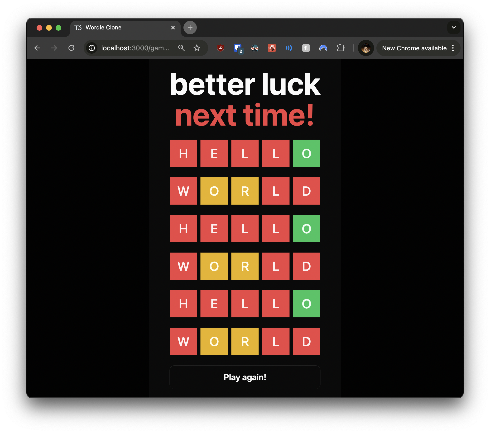

# 06: Game Over Implementation

Welcome to the sixth section of our tutorial! In this part, you'll implement **game over logic** in your Wordle clone. This includes handling game completion, displaying results, and allowing users to start a new game. By the end of this section, your game will provide a complete experience from start to finish.

## Prerequisites

Before you begin, ensure you've completed the previous section or are up to date with the `checkpoint-05-word-validation` branch.

**To get up to speed:**

1. **Switch to the branch:**

   ```bash
   git checkout checkpoint-05-word-validation
   ```

2. **Install dependencies:**

   ```bash
   yarn install
   ```

3. **Start the development server:**

   ```bash
   yarn dev
   ```

Once you've completed these steps, you're ready to implement the game over logic.

---

## Implementing Game Over Logic

To create a satisfying game experience, we need to handle scenarios where the player wins or loses. This involves updating the game status, displaying appropriate messages, and providing options to start a new game. We'll achieve this by updating our game page, modifying components, and enhancing our services.

### 1. Update the Game Page

First, we'll modify the game page to fetch both the game status and guesses. This allows us to determine whether the game is in progress, won, or lost, and render components accordingly.

**Open `src/app/game/[gameId]/page.tsx` and update it as follows:**

```typescript
// src/app/game/[gameId]/page.tsx

import { GameBoard } from "~/components/game-board";
import { GuessKeyboard } from "~/components/guess-keyboard";
import { GuessProvider } from "~/lib/store/guess-provider";
import { api } from "~/server/api";

// This is a server component; it does not have "use client" at the top
// We can fetch data directly from the server inside this component
export default async function GamePage({
  params: { gameId },
}: {
  params: { gameId: number };
}) {
  // Fetch both game and guesses data from the server
  const game = await api.games.getById(gameId);
  const guesses = await api.guesses.findByGameId(gameId);

  return (
    <GuessProvider>
      <div className="flex h-full flex-col items-center gap-6">
        <div className="flex flex-1 items-center justify-center">
          {/* Pass game status to GameBoard */}
          <GameBoard gameId={gameId} status={game.status} guesses={guesses} />
        </div>
        {/* Conditionally render the keyboard only if the game is in progress */}
        {game.status === "in_progress" && (
          <div className="flex w-full max-w-3xl items-center">
            <GuessKeyboard gameId={gameId} />
          </div>
        )}
      </div>
    </GuessProvider>
  );
}
```

In this update, we're fetching the game details (`game`) and the list of guesses (`guesses`) using the `api`. We pass the `game.status` to the `GameBoard` component, allowing it to render content based on the game's current state. We also conditionally render the `GuessKeyboard` component only when the game is in progress, ensuring that users can't make guesses after the game is over.

### 2. Update the `GameBoard` Component

Next, we'll modify the `GameBoard` component to handle different game statuses and incorporate a new `GameResults` component. This component will display messages when the game is won or lost.

**Update `src/components/game-board.tsx` as follows:**

```typescript
// src/components/game-board.tsx

import { type api } from "~/server/api";
import { type games } from "~/server/db/schema";

import { GameResults } from "./game-results";
import { GuessInput } from "./guess-input";
import { GuessList } from "./guess-list";

type GameBoardProps = {
  gameId: number;
  status: (typeof games.status.enumValues)[number];
  guesses: Awaited<ReturnType<typeof api.guesses.findByGameId>>;
};

export const GameBoard = ({ gameId, status, guesses }: GameBoardProps) => {
  return (
    <div className="flex grow flex-col items-center gap-6">
      {/* Always show the list of guesses */}
      <GuessList guesses={guesses} />
      {/* Only show GuessInput if the game is still in progress */}
      {status === "in_progress" && <GuessInput gameId={gameId} />}
      {/* Show game results when the game is over */}
      <GameResults status={status} />
    </div>
  );
};
```

By accepting the `status` prop, the `GameBoard` component can now render different content based on whether the game is ongoing or has ended. We always display the `GuessList` so the user can see their previous guesses. The `GuessInput` is only rendered if the game is in progress. Finally, we include the `GameResults` component to display win or lose messages when the game is over.

### 3. Create the `GameResults` Component

We'll develop a `GameResults` component that displays a message based on the game's outcome and provides a "Play Again" button for the user to start a new game.

**Create a new file `src/components/game-results.tsx` with the following content:**

```typescript
// src/components/game-results.tsx

"use client";

import { useCreateGame } from "~/lib/hooks/use-create-game";
import { type games } from "~/server/db/schema";

import { Button } from "./ui/button";

type GameResultsProps = {
  status: (typeof games.status.enumValues)[number];
};

// Separate component for the "Play Again" button
const PlayAgainButton = () => {
  const createGame = useCreateGame();

  return (
    <Button size="lg" onClick={createGame}>
      Play again!
    </Button>
  );
};

export const GameResults = ({ status }: GameResultsProps) => {
  // Use a switch statement to handle different game statuses
  switch (status) {
    case "in_progress":
      return null; // Don't show anything if the game is still in progress
    case "won":
      return (
        <div className="flex flex-col items-center gap-6">
          <div className="text-3xl font-bold text-green-400">
            Bam! You won! 🎉
          </div>
          <PlayAgainButton />
        </div>
      );
    case "lost":
      return (
        <div className="flex flex-col items-center gap-6">
          <div className="text-3xl font-bold text-red-400">You lost! 😭</div>
          <PlayAgainButton />
        </div>
      );
  }
};
```

This component uses a `switch` statement to render different content based on the `status` prop. If the game is still in progress, it returns `null`. If the game is won or lost, it displays a corresponding message and includes the `PlayAgainButton`.

The `PlayAgainButton` component uses a custom hook `useCreateGame` (which we'll create next) to start a new game when clicked.

### 4. Create a Custom Hook for Game Creation

To encapsulate the logic for creating a new game and navigating to it, we'll develop a `useCreateGame` hook. This makes it easy to reuse this functionality in multiple components.

**Create a new file `src/lib/hooks/use-create-game.ts` with the following content:**

```typescript
// src/lib/hooks/use-create-game.ts

import { useRouter } from "next/navigation";

import { api } from "~/server/api";

export const useCreateGame = (withRedirect = true) => {
  const router = useRouter();

  return async () => {
    // Create a new game using the API
    const game = await api.games.create();

    if (withRedirect) {
      // Redirect to the new game page if withRedirect is true
      router.push(`/game/${game.id}`);
    }

    return game;
  };
};
```

This hook uses Next.js's `useRouter` for navigation and calls `api.games.create()` to create a new game. If `withRedirect` is true, it navigates to the new game's page. By abstracting this logic into a hook, we can easily start new games from any component without duplicating code.

### 5. Update the Home Page

We'll modify the home page to use the `useCreateGame` hook, simplifying the code and improving reusability.

**Update `src/app/page.tsx` as follows:**

```typescript
// src/app/page.tsx

"use client";

import { Button } from "~/components/ui/button";
import { useCreateGame } from "~/lib/hooks/use-create-game";

export default function HomePage() {
  // Use the custom hook to create a new game
  const createGame = useCreateGame();

  return (
    <main className="flex h-full items-center justify-center">
      <Button
        onClick={async () => {
          await createGame();
          // No need to handle navigation here; it's done in the hook
        }}
      >
        New game
      </Button>
    </main>
  );
}
```

By using the `useCreateGame` hook, we remove the navigation logic from the component, keeping it clean and focused on rendering. The hook handles game creation and redirection, making the button's `onClick` handler straightforward.

### 6. Update the Guess Service

To implement the game over logic, we'll enhance the guess service to determine when the game is won or lost and update the game status accordingly.

**Update `src/server/services/guess.service.ts` as follows:**

```typescript
// src/server/services/guess.service.ts

import { asc, count, eq } from "drizzle-orm";
import { revalidatePath } from "next/cache";

import { db } from "../db";
import { games, guesses } from "../db/schema";
import { gameService } from "./game.service";

// ... (previous code remains the same)

const create = async (guess: string, gameId: number) => {
  const result = await checkGuess(guess, gameId);

  const [createdGuess] = await db
    .insert(guesses)
    .values({
      gameId,
      guess: guess.toUpperCase(),
      result,
    })
    .returning();

  if (!createdGuess) {
    throw new Error("Failed to create guess");
  }

  const count = await countByGameId(gameId);

  // Check for game over conditions
  if (count === 6 && createdGuess.result.includes("X")) {
    // If it's the 6th guess and not all correct, the game is lost
    await gameService.update(gameId, "lost");
  }

  if (createdGuess.result === "CCCCC") {
    // If all letters are correct, the game is won
    await gameService.update(gameId, "won");
  }

  // Trigger a revalidation of the game page to reflect the new state
  revalidatePath(`/game/${gameId}`);

  return createdGuess;
};

// ... (rest of the code remains the same)

const countByGameId = async (gameId: number) => {
  // Count the number of guesses for a specific game
  const [gameCount] = await db
    .select({ count: count() })
    .from(guesses)
    .where(eq(guesses.gameId, gameId));

  if (!gameCount) {
    throw new Error("Error counting guesses");
  }

  return gameCount.count;
};

export const guessService = {
  create,
  findByGameId,
};
```

In this update, after creating a new guess, we check for game over conditions:

- **Win Condition:** If the `result` is `"CCCCC"`, it means the user has guessed the word correctly, and we update the game status to `"won"`.
- **Loss Condition:** If the user has made six guesses and hasn't guessed the word correctly, we update the game status to `"lost"`.

We use the `countByGameId` function to determine how many guesses have been made for the current game. After updating the game status, we call `revalidatePath` to refresh the game page so the client sees the updated game status.

---

## Checking Your Progress

Now that you've implemented the game over logic and new game creation, it's time to test your application.

**Instructions:**

1. **Start the Development Server:**

   ```bash
   yarn dev
   ```

2. **Start a New Game:**

   - Navigate to `http://localhost:3000`.
   - Click the "New game" button on the home page.
   - You should be redirected to a new game page (e.g., `http://localhost:3000/game/1`).

3. **Play Through a Game:**

   - **Win Scenario:**

     

     - Guess the correct word within six attempts.
     - The keyboard should disappear upon winning.
     - A victory message ("Bam! You won! 🎉") should be displayed.
     - A "Play again!" button should appear.

   - **Lose Scenario:**

     

     - Make six incorrect guesses.
     - The keyboard should disappear upon losing.
     - A losing message ("You lost! 😭") should be displayed.
     - A "Play again!" button should appear.

4. **Check Game Status Persistence:**

   - Refresh the page after winning or losing.
   - The game over state should persist, showing the same message and not resetting the game.

5. **Start a New Game from Game Over State:**

   - Click the "Play again!" button.
   - You should be redirected to a new game page with a fresh board and keyboard.

If everything works as expected, congratulations! You've successfully implemented game over logic in your Wordle clone.

---

## Next Steps

In the next section, we'll focus on adding final touches to our game, such as:

- **UI Enhancements:**

  - Adding animations for guess submissions.
  - Improving the overall styling and responsiveness.

By continuing to refine your application, you'll enhance the user experience and solidify your understanding of state management and component interaction in React.

---
