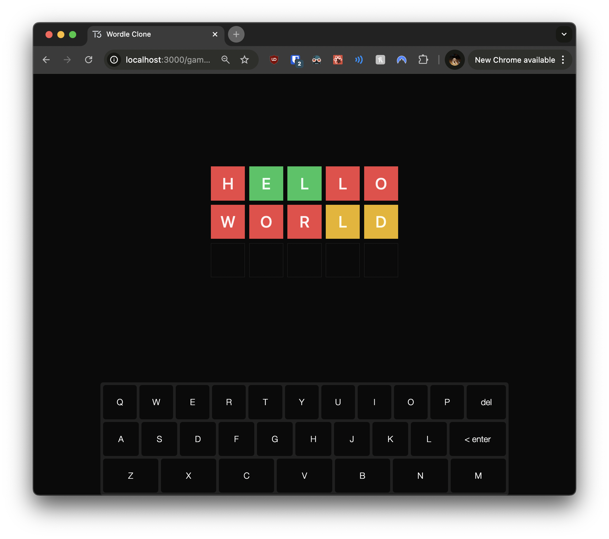

# 07: Styling and Polish

Welcome to the final section of the tutorial! In this part, you'll add visual polish to your Wordle clone, enhancing the user experience with improved styling and engaging effects. We'll focus on:

- Enhancing the game board for better visibility.
- Creating an engaging game over dialog with animations.
- Refining the styling of the guess input and on-screen keyboard.

These changes will make your game more enjoyable and visually appealing, similar to refining UI components in Angular applications.

## Exercise Objectives

- **Enhance** the game board's appearance for better user engagement.
- **Improve** the guess input styling to match the game board.
- **Create** an engaging game over dialog with animations.
- **Refine** the on-screen keyboard's styling for consistency.
- **Add** celebratory effects using `react-confetti`.

---

## Prerequisites

Before you begin, ensure you've completed the previous section or are up to date with the `checkpoint-06-game-over` branch.

**To get up to speed:**

1. **Switch to the branch:**

   ```bash
   git checkout checkpoint-06-game-over
   ```

2. **Install dependencies:**

   ```bash
   yarn install
   ```

3. **Start the development server:**

   ```bash
   yarn dev
   ```

Once you've completed these steps, you're ready to add the final polish to your Wordle clone.

---

## Tasks and Hints

### Exercise 1: Install `react-confetti`

Your first task is to install the `react-confetti` library, which will allow you to add a celebratory effect when the player wins the game.

**Instructions:**

- Run the following command to install the dependency:

  ```bash
  yarn add react-confetti
  ```

---

### Exercise 2: Enhance the Game Board

You'll improve the appearance of your game board to make it more engaging for users.

**Instructions:**

1. Open `src/components/guess-item.tsx`.
2. Adjust the styling of the `GuessItemSlot` component to increase the size and improve the color scheme.

**Hints:**

- Increase the height and width of the slots for better visibility.
- Use more vibrant colors to enhance user feedback.
- Apply consistent styling for a polished look.

Here's a starting point for your updated `GuessItemSlot` component:

```typescript
// src/components/guess-item.tsx

function GuessItemSlot({ index, result }: { index: number; result: string }) {
  return (
    <InputOTPSlot
      index={index}
      className={
        cn()
        // TODO: Increase the size of the slots and adjust styling
        // For example, use "h-16 w-16" and "text-3xl" for larger slots and text
        // Apply vibrant background colors based on the result
        // Use "bg-red-500", "bg-green-500", "bg-yellow-500" for different results
      }
    />
  );
}
```

When you're ready, check your implementation against the provided solution.

---

<details>
<summary>👉 Click here to see the solution 👈</summary>

```typescript
// src/components/guess-item.tsx

function GuessItemSlot({ index, result }: { index: number; result: string }) {
  return (
    <InputOTPSlot
      index={index}
      className={cn(
        // Increase size and adjust styling for better visibility
        "h-16 w-16 border-none text-3xl font-medium uppercase first:rounded-l-none last:rounded-r-none",
        {
          // Update color scheme for more vibrant feedback
          "bg-red-500 text-red-50": result === "X",
          "bg-green-500 text-green-50": result === "C",
          "bg-yellow-500 text-yellow-50": result === "~",
        }
      )}
    />
  );
}
```

</details>

---

### Exercise 3: Improve the Guess Input

Next, you'll enhance the appearance of the guess input to match the styled guess items.

**Instructions:**

1. Open `src/components/guess-input.tsx`.
2. Create a separate `GuessItemSlot` component to reuse styling.
3. Adjust the styling to align with the game board.

**Hints:**

- Use the same height, width, and text size as in `GuessItemSlot` from `guess-item.tsx`.
- Ensure consistent styling for a cohesive user experience.
- You can create a shared component or reuse the styling classes.

Here's a starting point for your updated `GuessInput` component:

```typescript
// src/components/guess-input.tsx

"use client";

import { useGuess } from "~/lib/hooks/use-guess";

// TODO: Import InputOTP components
// import { InputOTP, InputOTPGroup, InputOTPSlot } from "./ui/input-otp";

type GuessInputProps = {
  gameId: number;
};

// TODO: Create a GuessItemSlot component with consistent styling
function GuessItemSlot({ index }: { index: number }) {
  return (
    <InputOTPSlot
      index={index}
      // TODO: Apply the same styling as in the GuessItemSlot from guess-item.tsx
      // For example: "h-16 w-16 text-3xl font-medium uppercase"
    />
  );
}

export const GuessInput = ({ gameId }: GuessInputProps) => {
  const { guess, setGuess } = useGuess();

  return (
    <InputOTP
      maxLength={5}
      value={guess}
      onChange={(value) => setGuess(value)}
      onComplete={async (value) => {
        // TODO: Submit the guess using the API and handle errors
      }}
    >
      <InputOTPGroup className="gap-2">
        {[0, 1, 2, 3, 4].map((index) => (
          <GuessItemSlot key={index} index={index} />
        ))}
      </InputOTPGroup>
    </InputOTP>
  );
};
```

When you're ready, check your implementation against the provided solution.

---

<details>
<summary>👉 Click here to see the solution 👈</summary>

```typescript
// src/components/guess-input.tsx

"use client";

import { useGuess } from "~/lib/hooks/use-guess";
import { api } from "~/server/api";

import { InputOTP, InputOTPGroup, InputOTPSlot } from "./ui/input-otp";

type GuessInputProps = {
  gameId: number;
};

// Create a separate component for consistent styling
function GuessItemSlot({ index }: { index: number }) {
  return (
    <InputOTPSlot
      index={index}
      // Match styling with guess items
      className="h-16 w-16 border text-3xl font-medium uppercase first:rounded-l-none last:rounded-r-none"
    />
  );
}

export const GuessInput = ({ gameId }: GuessInputProps) => {
  const { guess, setGuess } = useGuess();

  return (
    <InputOTP
      maxLength={5}
      value={guess}
      onChange={(value) => setGuess(value)}
      onComplete={async (value) => {
        try {
          // Submit the guess when input is complete
          await api.guesses.create(value, gameId);
          setGuess("");
        } catch (error) {
          console.error(error);
        }
      }}
    >
      <InputOTPGroup className="gap-2">
        {[0, 1, 2, 3, 4].map((index) => (
          <GuessItemSlot key={index} index={index} />
        ))}
      </InputOTPGroup>
    </InputOTP>
  );
};
```

</details>

---

### Exercise 4: Create an Engaging Game Over Dialog

Now, you'll replace the simple game results display with a more engaging dialog, including animations.

**Instructions:**

1. Create a new file `src/components/game-results-dialog.tsx`.
2. Implement the `GameResultsDialog` component.
3. Use `react-confetti` for a celebratory effect when the player wins.
4. Display all guesses in the dialog.

**Hints:**

- Use the `Dialog` and `DialogContent` components for the modal dialog.
- Conditionally render content based on the game status (`"won"` or `"lost"`).
- Use the `Confetti` component from `react-confetti` for the win animation.

Here's a starting point for your `GameResultsDialog` component:

```typescript
// src/components/game-results-dialog.tsx

"use client";

import { useCreateGame } from "~/lib/hooks/use-create-game";
import { type api } from "~/server/api";
import { type games } from "~/server/db/schema";

// TODO: Import necessary components
// import Confetti from "react-confetti";
// import { Dialog, DialogContent } from "./ui/dialog";
// import { GuessItem } from "./guess-item";
// import { Button } from "./ui/button";

type GameResultsDialogProps = {
  status: (typeof games.status.enumValues)[number];
  guesses: Awaited<ReturnType<typeof api.guesses.findByGameId>>;
};

export const GameResultsDialog = ({
  status,
  guesses,
}: GameResultsDialogProps) => {
  const createGame = useCreateGame();

  if (status === "in_progress") return null;

  return (
    <Dialog open={true}>
      <DialogContent
        // TODO: Style the dialog for a more engaging appearance
        // For example, use "flex flex-col items-center gap-6 rounded-2xl p-12 md:max-w-fit"
        withClose={false}
      >
        {status === "won" ? (
          <>{/* TODO: Add win message and confetti effect */}</>
        ) : (
          <>{/* TODO: Add lose message */}</>
        )}
        {/* TODO: Display all guesses */}
        {/* TODO: Add Play Again button */}
      </DialogContent>
    </Dialog>
  );
};
```

When you're ready, check your implementation against the provided solution.

---

<details>
<summary>👉 Click here to see the solution 👈</summary>

```typescript
// src/components/game-results-dialog.tsx

"use client";

import { useCreateGame } from "~/lib/hooks/use-create-game";
import { type api } from "~/server/api";
import { type games } from "~/server/db/schema";

import Confetti from "react-confetti";
import { Dialog, DialogContent } from "./ui/dialog";
import { GuessItem } from "./guess-item";
import { Button } from "./ui/button";

type GameResultsDialogProps = {
  status: (typeof games.status.enumValues)[number];
  guesses: Awaited<ReturnType<typeof api.guesses.findByGameId>>;
};

export const GameResultsDialog = ({
  status,
  guesses,
}: GameResultsDialogProps) => {
  const createGame = useCreateGame();

  if (status === "in_progress") return null;

  return (
    <Dialog open={true}>
      <DialogContent
        className="flex flex-col items-center gap-6 rounded-2xl p-12 md:max-w-fit"
        withClose={false}
      >
        {status === "won" ? (
          <>
            <div className="flex flex-col items-center gap-6">
              <div className="text-center">
                <div className="text-7xl font-bold">you are</div>
                <div className="text-7xl font-bold text-green-500">
                  awesome!
                </div>
              </div>
              {guesses.map((guess) => (
                <GuessItem key={guess.id} guess={guess} />
              ))}
            </div>
            <Confetti
              className="h-full w-full"
              numberOfPieces={200}
              gravity={0.05}
            />
          </>
        ) : (
          <div className="flex flex-col items-center gap-6">
            <div className="text-center">
              <div className="text-7xl font-bold">better luck</div>
              <div className="text-7xl font-bold text-red-500">next time!</div>
            </div>
            {guesses.map((guess) => (
              <GuessItem key={guess.id} guess={guess} />
            ))}
          </div>
        )}
        <Button
          variant="outline"
          className="h-14 w-full rounded-xl text-xl font-semibold"
          size="lg"
          onClick={() => createGame()}
        >
          Play again!
        </Button>
      </DialogContent>
    </Dialog>
  );
};
```

</details>

---

### Exercise 5: Update the `GameBoard` Component

You'll modify the `GameBoard` component to use the new `GameResultsDialog` for displaying game over messages.

**Instructions:**

1. Open `src/components/game-board.tsx`.
2. Replace the old `GameResults` component with `GameResultsDialog`.
3. Adjust the component structure if necessary.

**Hints:**

- Ensure you pass the required props (`status` and `guesses`) to `GameResultsDialog`.
- Remove or comment out the old `GameResults` component to avoid confusion.

Here's a starting point for your updated `GameBoard` component:

```typescript
// src/components/game-board.tsx

import { type api } from "~/server/api";
import { type games } from "~/server/db/schema";

// TODO: Import GameResultsDialog instead of GameResults
// import { GameResultsDialog } from "./game-results-dialog";
import { GuessInput } from "./guess-input";
import { GuessList } from "./guess-list";

type GameBoardProps = {
  gameId: number;
  status: (typeof games.status.enumValues)[number];
  guesses: Awaited<ReturnType<typeof api.guesses.findByGameId>>;
};

export const GameBoard = ({ gameId, status, guesses }: GameBoardProps) => {
  return (
    <div className="flex grow flex-col items-center gap-6">
      <div className="flex flex-col gap-2">
        {/* Display the list of guesses */}
        <GuessList guesses={guesses} />
        {/* Only show GuessInput if the game is still in progress */}
        {status === "in_progress" && <GuessInput gameId={gameId} />}
      </div>
      {/* TODO: Add the new GameResultsDialog component */}
    </div>
  );
};
```

When you're ready, check your implementation against the provided solution.

---

<details>
<summary>👉 Click here to see the solution 👈</summary>

```typescript
// src/components/game-board.tsx

import { type api } from "~/server/api";
import { type games } from "~/server/db/schema";

import { GameResultsDialog } from "./game-results-dialog";
import { GuessInput } from "./guess-input";
import { GuessList } from "./guess-list";

type GameBoardProps = {
  gameId: number;
  status: (typeof games.status.enumValues)[number];
  guesses: Awaited<ReturnType<typeof api.guesses.findByGameId>>;
};

export const GameBoard = ({ gameId, status, guesses }: GameBoardProps) => {
  return (
    <div className="flex grow flex-col items-center gap-6">
      <div className="flex flex-col gap-2">
        {/* Display the list of guesses */}
        <GuessList guesses={guesses} />
        {/* Only show GuessInput if the game is still in progress */}
        {status === "in_progress" && <GuessInput gameId={gameId} />}
      </div>
      {/* Add the new GameResultsDialog component */}
      <GameResultsDialog status={status} guesses={guesses} />
    </div>
  );
};
```

</details>

---

### Exercise 6: Refine the On-Screen Keyboard

Finally, you'll improve the styling of the on-screen keyboard for a more polished look.

**Instructions:**

1. Open `src/components/guess-keyboard.tsx`.
2. Adjust the keyboard layout and button styling.
3. Ensure the keyboard integrates well with the updated game board and input.

**Hints:**

- Modify the `buttonTheme` to adjust the appearance of the keys.
- Update the `layout` and `display` props for better key arrangement.
- Ensure the keys are larger and easier to interact with.

```typescript
// src/components/guess-keyboard.tsx

"use client";

import "react-simple-keyboard/build/css/index.css";

import Keyboard from "react-simple-keyboard";

import { useGuess } from "~/lib/hooks/use-guess";
import { api } from "~/server/api";

type GuessKeyboardProps = {
  gameId: number;
};

export const GuessKeyboard = ({ gameId }: GuessKeyboardProps) => {
  const { guess, setGuess } = useGuess();

  return (
    <Keyboard
      layout={{
        default: [
          "Q W E R T Y U I O P",
          "A S D F G H J K L",
          "{enter} Z X C V B N M {bksp}",
        ],
      }}
      display={{
        "{enter}": "enter",
        "{bksp}": "⌫",
      }}
      maxLength={5}
      value={guess}
      onChange={(value) => setGuess(value)}
      onKeyPress={async (button) => {
        if (button === "{enter}" && guess.length === 5) {
          try {
            // Submit the guess when Enter is pressed
            await api.guesses.create(guess, gameId);
            setGuess("");
          } catch (error) {
            console.error(error);
          }
        }
      }}
      buttonTheme={[
        {
          // Improve button styling for a more polished look
          class:
            "!bg-background !text-foreground !border-none !shadow-none hover:!bg-secondary/50 active:!bg-white/25 !h-16",
          buttons:
            "Q W E R T Y U I O P A S D F G H J K L Z X C V B N M {bksp} {enter}",
        },
      ]}
    />
  );
};
```

</details>

---

## Checking Your Progress

Now that you've implemented these styling and polish improvements, it's time to test your application.

**Instructions:**

1. **Start the Development Server:**

   ```bash
   yarn dev
   ```

2. **Navigate to a Game:**

   - Open your browser and go to `http://localhost:3000`.
   - Start a new game by clicking the "New game" button.

3. **Check the Game Board Appearance:**



- **Game Board:**
  - The guess slots should be larger (`h-16 w-16`) with bigger letters (`text-3xl`).
  - There should be a gap between each letter due to `gap-2`.
  - The color-coding for guesses should be more vibrant.

4. **Test the Guess Input:**

   - **Consistency:**
     - The input slots should match the styling of the guess slots.
   - **Functionality:**
     - Typing letters should fill the slots.
     - The input should automatically submit when all slots are filled.

5. **Test the On-Screen Keyboard:**

   - **Appearance:**
     - The keyboard should have larger keys (`!h-16`).
     - Keys should have consistent styling with the rest of the app.
   - **Functionality:**
     - Pressing keys should update the guess input.
     - The "enter" key should submit the guess when appropriate.

6. **Play Through a Game:**

   - **Make Guesses:**
     - Observe the enhanced feedback with the updated color scheme.
     - Ensure the guess input clears after each submission.

7. **Check the Game Over Dialog:**

   - **Winning:**
     
     - Win the game to see the confetti animation.
     - The dialog should display a congratulatory message in large, bold text.
   - **Losing:**
     
     - Lose the game to see the encouraging message.
   - **Common Elements:**
     - The dialog should display all your guesses.
     - A "Play again!" button should be present and functional.

If everything works as expected, congratulations! You've successfully polished your Wordle clone.

---

## Next Steps

Now that you've completed the tutorial, consider exploring additional enhancements:

- **Animations:**
  - Add flip or bounce animations to the guess slots when submitting guesses.
- **Accessibility:**
  - Ensure the game is accessible by adding ARIA labels and keyboard navigation.
- **Mobile Responsiveness:**
  - Optimize the layout and components for mobile devices.
- **Leaderboard Feature:**
  - Implement a leaderboard to track high scores or fastest wins.
- **Social Sharing:**
  - Allow users to share their results on social media platforms.
